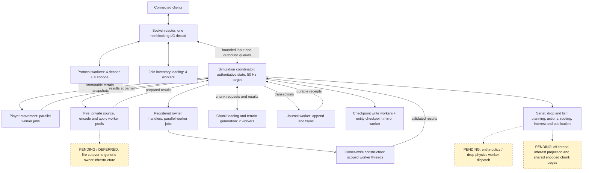
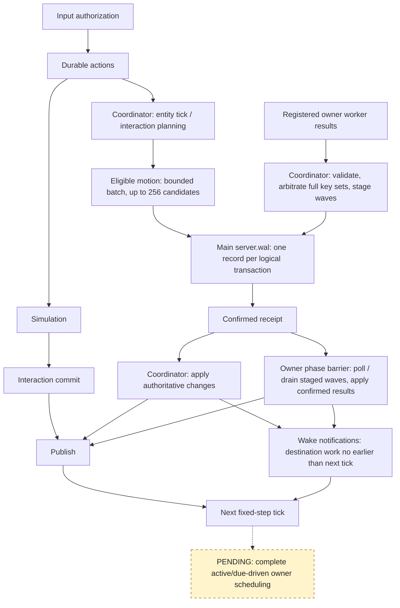
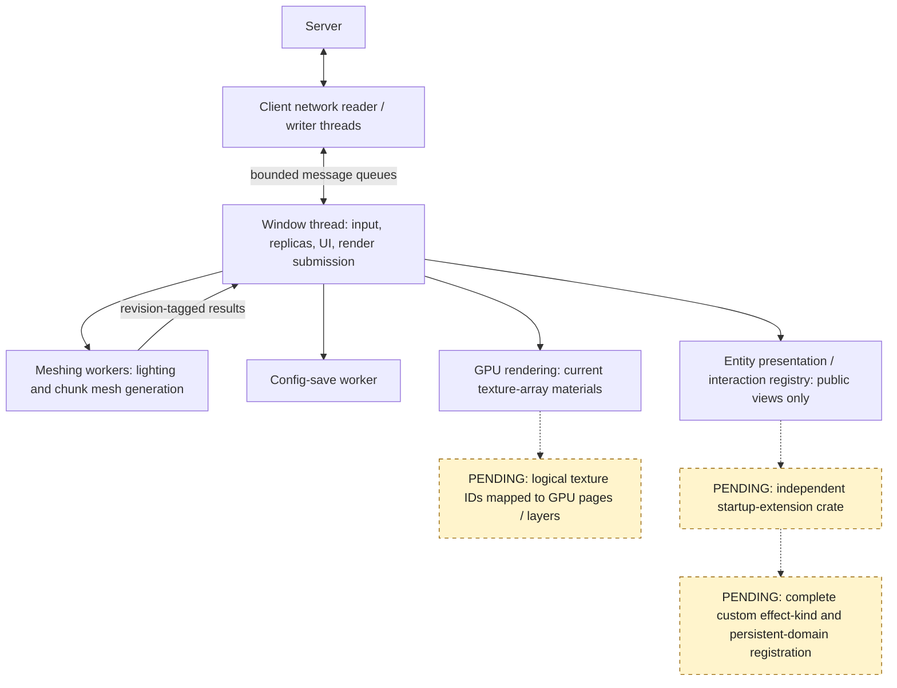

# Bloxgloom

Bloxgloom is a Rust multiplayer voxel game. The dedicated server owns a procedural, editable world; the desktop client renders streamed chunks with `wgpu` and uses `winit` for input.

The client/server event flow and tick loop are documented in [docs/runtime-architecture.md](docs/runtime-architecture.md). The active foundation contract and its remaining acceptance gates are in [docs/growth-foundation-plan.md](docs/growth-foundation-plan.md); it is not a claim that the whole foundation is complete. The earlier simulation design and implementation record remain in [docs/server-simulation.md](docs/server-simulation.md).

The world generates on demand as players travel, with no fixed horizontal boundary. Temperature, moisture, and uplift create plains, forests, deserts, tundra, and rocky highlands with distinct landforms and surface layers. A deterministic wave-function-collapse pass makes constrained ground-cover patches that match across independently generated regions. Biome-aware flowers, ferns, grass, and broadleaf trees add vegetation that stays consistent across chunk borders; plants can be broken and collected. Caves remain below the surface, but the new-world spawn has a solid floor beneath it; the world has an immutable solid bottom at Y = −64. Built-in blocks use pixel-art assets in `assets/textures/`. Opaque blocks use greedy chunk meshes; foliage uses a separate cutout mesh. The sky has world-anchored clouds and shares a fixed sun direction with terrain lighting, so the sun moves across the view when you turn.

Voxel skylight travels down open columns and diffuses into caves; placeable glowstone emits warm local light. This is the default lighting mode. In Settings, `LIGHTING: BOUNCED` enables a more expensive single diffuse RGB bounce from block surfaces, including color bleed. It is a voxel approximation, not path tracing or multi-bounce GI. Lighting is derived from nearby chunk snapshots on meshing workers and refreshed after edits or quality changes, including across chunk seams. Mesh corners average nearby light for soft transitions, and unlit cave fog stays dark. An unstreamed neighboring chunk uses its procedural baseline until the server snapshot arrives.

The current default save directory is `world-v6/`. Incompatible older worlds are rejected explicitly; this pre-release project does not provide world-upgrade tooling. Development checks and benchmarks use isolated temporary directories and do not delete repo-local saves.

Blocks, legal block states, items, entity types, and texture layers have namespaced definitions in a startup content catalog. New worlds record their numeric ID mapping in `content.map`; a world refuses to load when an existing ID is reassigned or required content is missing, and multiplayer rejects clients with a different catalog. Save and wire content IDs are widened to 32 bits. This is groundwork for future mod loading, not a mod-file format or scripting API yet.

## Run locally

With a recent Rust toolchain, run a local game with one command:

```sh
cargo run
```

This starts a local server and client in the same process and saves edits in `world-v6/`. Cube-face textures live in `assets/textures/blocks/`, leaf and plant cutouts in `assets/textures/foliage/`, and non-block item art in `assets/textures/items/`.

For a dedicated multiplayer server, start the server in one terminal:

```sh
cargo run -- server 127.0.0.1:4000 world-v6
```

Start one or more clients in other terminals:

```sh
cargo run -- client 127.0.0.1:4000
```

The server defaults to `127.0.0.1:4000` and saves edits in `world-v6/`. To connect from another computer on your LAN, bind the server to a reachable address (for example `0.0.0.0:4000`) and pass that computer's address to the client. Admission defaults to 128 clients and can be configured up to 256; 128-client loopback TCP baselines have passed, but the combined gameplay acceptance workload remains unverified.

Click the window to capture the mouse. Use WASD to fly horizontally, Space and Shift to ascend and descend. The crosshair marks the targeted block: left click harvests it, and right click places a block from the selected hotbar stack against it. Flowers drop themselves; tall grass can drop seeds, and leaves can drop leaves, sticks, and saplings. Seeds, sticks, and saplings are inventory items, not placeable blocks. Walk near a drop to pick it up. Use 1–9 or the mouse wheel to select a hotbar slot. Press Q to drop one selected item, or Shift+Q to drop its full stack.

E opens the 36-slot inventory (27 backpack slots and nine hotbar slots). Select a source slot, then left-click a destination to move its whole stack; right-click the destination to move half. Matching stacks merge up to 128 blocks; moving a full stack onto a different block swaps them. Escape opens the pause menu, where you can resume, change settings, or exit. F3 toggles the debug HUD. The local game also has an admin menu on F4 or the pause menu: click a catalog item to grant a stack of 128, or type `give namespace:item [count]` and press Enter. `help` lists available commands. These grants are authorized and persisted by the local server; dedicated multiplayer servers do not grant admin access by default.

Blocks are now finite: the server owns inventory, drops, pickup, and placement. Breaking a block pops its drop upward; resting drops hover and spin, then fly toward the player when picked up. A full inventory leaves drops in the world. Inventory and world drops persist in the server save directory; drops expire after ten minutes. Each OS user has a persistent local profile ID for their inventory and saved position; simultaneous connections with that same profile are rejected. Exiting the local game saves the last authoritative position, and restarting restores it unless that position has become obstructed. Movement remains server-authoritative with block collision; gravity and other survival systems are not implemented yet. The inventory/drop protocol is versioned; older clients must be rebuilt.

The server targets a 50 Hz fixed-step simulation even with no clients connected. A coordinator owns authoritative state and orders durable actions; movement and fire jobs use worker pools over authoritative terrain views. Drops and the two-cell kiln use registered entity policies, whose planning currently runs on the coordinator. Disk writes run on workers, but commit barriers can wait for their receipts. See the execution diagrams below for the distinction between implemented parallelism and pending work.

## Current execution architecture

These diagrams describe the current Rust execution paths. **Solid arrows are implemented paths. Dashed arrows and nodes labelled `PENDING` are planned work, not active execution.** A registered entity policy is not automatically a worker job: `EntityTickPolicy` and the registered owner-system executor are separate paths.

### Server threads and workers



- **Player movement and fire computation are parallel today.** Fire retains its own scheduler, mailboxes and checkpoint machinery; its generic-path migration is deferred.
- **Registered owner handlers run on workers**, with revisioned snapshots and coordinator-controlled commits. This path is available to startup-registered systems; it does not implicitly execute every registered entity type.
- **Drop physics, kiln ticks and entity interactions are planned serially.** Drops now share entity identity, storage and recovery, but this consolidation did not move their tick planners onto worker threads.
- Input authorization, block edits, inventory actions, pickups, transfer planning, effect routing and interest projection remain coordinator work. Shared mutable world state is not handed to workers.

### Tick and durable commit paths



The five tick phases run in order. The commit branches above show shared mechanisms, not additional threads or a claim that every system runs in every phase.

- Owner waves can be submitted before earlier receipts are polled, but **the phase barrier drains before advancing**. This is overlapping submission, not a fully nonblocking tick loop.
- A tick that stages a motion batch drains staged receipts before completing its durable phase. This removes ordinary receipt-poll timing from admitted drop steps, at the cost of waiting for the journal. Terrain availability, admission limits and rotation can still defer work.
- Built-in durable actions remain coordinator-ordered. Atomic pickup and cross-entity transfers put all affected state into one transaction; a receipt gates visibility.
- Owner cells, pending owner wakes and rotation cursors use domains in the same journal. Recovery and journal rotation preserve them. Pending owner wakes for absent destinations are durable; entity wake attempts also have a separate transient queue.
- Effect consumers schedule work rather than directly modifying world or inventory state. Scheduled work must remain correct without an accelerating notification.
- Persisted round-robin cursors currently drive normal owner-system selection. The complete active/due-driven scheduling path remains pending.

### Client execution and remaining extension work



Client presentation never decides item ownership. Server snapshots and explicit pickup events control authoritative state; drop hover, spin and pickup flight are visual effects. Worker mesh/light results carry revisions so stale results can be discarded.

Other pending foundation work includes a usable policy for dense neighbour views (capacity currently rejects local planning), completing worker-based entity execution, and exercising the registration interfaces with a real independent extension crate. Public mod loading and scripting remain future work.

Code entry points: [`src/server/runtime.rs`](src/server/runtime.rs), [`src/server/runtime/systems.rs`](src/server/runtime/systems.rs), [`src/server/durable/coordinator.rs`](src/server/durable/coordinator.rs), [`src/server/durable/actions/entity.rs`](src/server/durable/actions/entity.rs), [`src/server/net/reactor.rs`](src/server/net/reactor.rs), and [`src/client/workers.rs`](src/client/workers.rs).

## Development and previews

The client logs FPS, frame-time percentiles, visible chunks, triangles, and upload backlog every five seconds. Run `cargo test` for the world, protocol, server, UI, and meshing checks. The interface implementation and validation record are in [PLAN.md](PLAN.md).

For visual debugging without a desktop display, run `cargo run -- preview preview.png` or `cargo run -- preview desert.png -928 -1024` to center the render near specified world coordinates. This renders terrain through the same GPU shader and mesh pipeline and writes a PNG that can be inspected directly.

Run `cargo run -- ui-preview ui-previews` to render the Playing, Inventory, Admin, Pause, and Settings screens at 1280×720, 640×360, and 640×360 with 2× requested UI scale, plus sun-facing and sun-away views, without opening a game window.

Run `cargo run -- lighting-preview lighting-previews` to compare a sealed cave, a lamp under default lighting, and the same lamp under bounced lighting through the production mesh and GPU shader pipeline.

Run `cargo run -- vegetation-preview vegetation-preview.png` to inspect trees and plant cutouts through the production GPU path without opening a window.

Run `cargo run -- drop-preview drops.png` to render a few textured world drops through the production GPU pipeline without opening a game window.

Run `cargo run -- drop-animation-preview drop-frames` to inspect the pop, hover, and pickup states as three headless GPU renders.

Run `cargo run --release -- perf 300 6` to measure headless 1280×720 chunk-upload, world-render, target-outline, and HUD work at the maximum supported view radius. It reports CPU submit-side and GPU render-pass frame-time percentiles, adapter, and scene size. It does not measure window presentation or live gameplay FPS.

Run `cargo run --release -- server-perf 300` to measure separate 16-player clustered and spread authoritative server workloads at 50 Hz. It uses isolated temporary saves and reports tick, backlog, worker, chunk-load, WAL, and replication metrics. This headless benchmark does not measure TCP socket writes or client graphics.

Run `cargo run --release -- server-perf fire-cpu --workers 1 --iterations 3000` and repeat with `--workers 4` for matched fire-compute measurements. Run `cargo run --release -- server-perf tcp --clients 128 --ticks 15000 --scene clustered` (or `spread`) for paced production-listener TCP measurements. These are separate workloads; a network baseline alone does not establish the combined foundation gate.

Append `bounced` to benchmark the optional lighting mode, for example `cargo run --release -- perf 300 6 bounced`. Scene setup includes light-field construction and meshing; its time is reported separately from steady frame samples.
