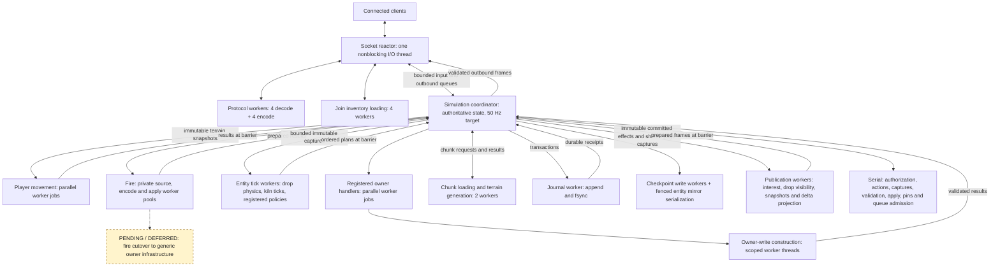
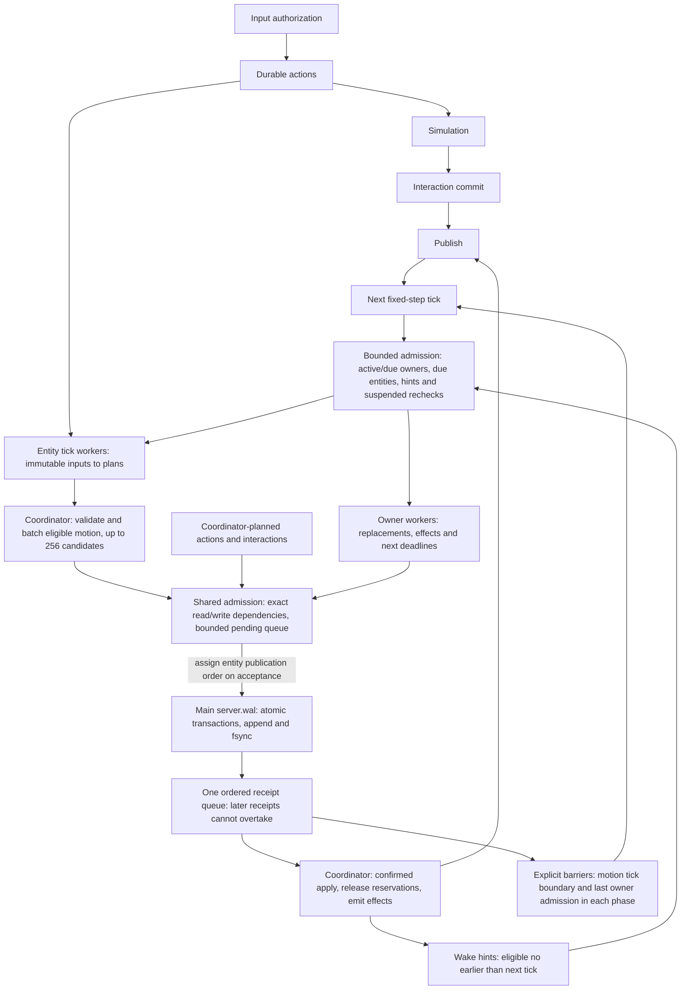
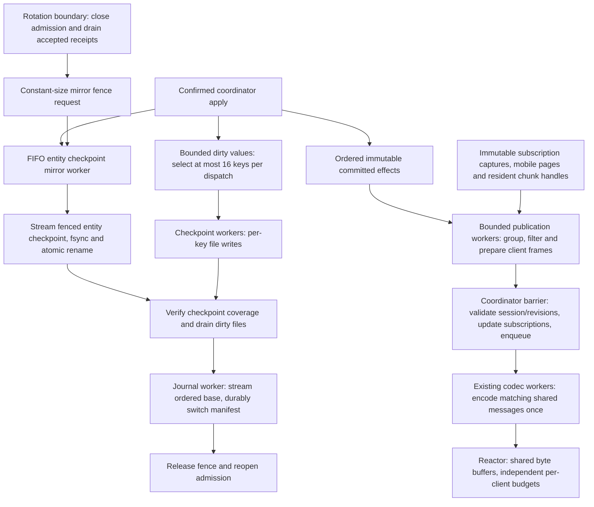
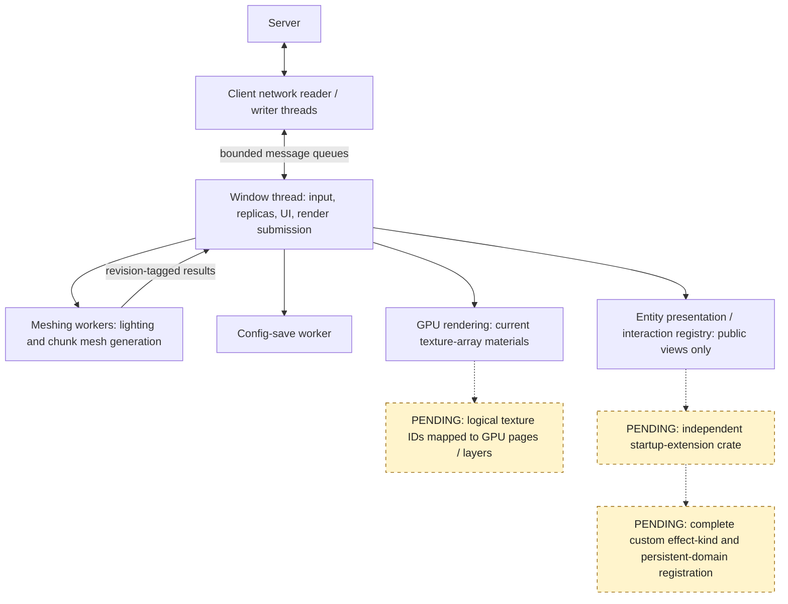

# Bloxgloom

Bloxgloom is a Rust multiplayer voxel game. The dedicated server owns a procedural, editable world; the desktop client renders streamed chunks with `wgpu` and uses `winit` for input.

The current client/server execution paths are documented in the
[architecture diagrams below](#current-execution-architecture).

**Modding:** Start at [docs/modding/](docs/modding/README.md) for authoring
examples and API references. The approved eight-phase implementation is complete;
[Phase 8 acceptance](docs/modding/PHASE-8-ACCEPTANCE.md) records the evidence and
[LUAU-SCRIPTING-GAPS.md](LUAU-SCRIPTING-GAPS.md) lists the current limitations.
Earlier plans and audits are preserved in [docs/archive/](docs/archive/README.md).

The world generates on demand as players travel, with no fixed horizontal boundary. Temperature, moisture, and uplift create plains, forests, deserts, tundra, and rocky highlands with distinct landforms and surface layers. A deterministic wave-function-collapse pass makes constrained ground-cover patches that match across independently generated regions. Biome-aware flowers, ferns, grass, and broadleaf trees add vegetation that stays consistent across chunk borders; plants can be broken and collected. Caves remain below the surface, but the new-world spawn has a solid floor beneath it; the world has an immutable solid bottom at Y = −64. Built-in blocks use pixel-art assets in `assets/textures/`. Opaque blocks use greedy chunk meshes; foliage uses a separate cutout mesh. The sky has world-anchored clouds and shares a fixed sun direction with terrain lighting, so the sun moves across the view when you turn.

Placing glowstone ignites adjacent wood and leaves after one second of simulation time; fire spreads to their neighbours at the same pace. Grass, moss, and ground-cover plants do not burn.

Voxel skylight travels down open columns and diffuses into caves; placeable glowstone emits warm local light. This is the default lighting mode. In Settings, `LIGHTING: BOUNCED` enables a more expensive single diffuse RGB bounce from block surfaces, including color bleed. It is a voxel approximation, not path tracing or multi-bounce GI. Lighting is derived from nearby chunk snapshots on meshing workers and refreshed after edits or quality changes, including across chunk seams. Mesh corners average nearby light for soft transitions, and unlit cave fog stays dark. An unstreamed neighboring chunk uses its procedural baseline until the server snapshot arrives.

The native character editor is available under **Pause → Character**. It supports the authored animated kit, thirteen hairstyles plus no hair, eight eye styles, six mouths, and optional iris color. Applied choices are validated and saved by the server and replicated to peers. See the [character kit guide](assets/models/player/README.md) for animation previews, compatibility, and rendering limits.

The current default save directory is `world-v21/`. Incompatible older worlds are rejected explicitly; this pre-release project does not provide world-upgrade tooling. Development checks and benchmarks use isolated temporary directories and do not delete repo-local saves.

Blocks, legal block states, items, entity types, and texture layers have namespaced definitions in a startup content catalog. New worlds record their numeric ID mapping in `content.map`; a world refuses to load when an existing ID is reassigned or required content is missing, and multiplayer rejects clients with a different catalog. Save and wire content IDs are widened to 32 bits. Local Luau packages and server-delivered client content are implemented; see the [current scripting reference](SCRIPTING.md).

### HDR presentation

The world renders into a linear `RGBA16Float` scene buffer, followed by quarter-resolution soft-threshold bloom and neutral, fixed-exposure tone mapping to the display. Glowstone and the sun retain HDR highlights; the HUD and selection outline are drawn afterward. Exposure does not adapt when entering caves. This is an internal HDR pipeline with SDR output, so no HDR monitor is required.

Open **Escape → Settings → Graphics** to adjust exposure and bloom strength live. **Post Effects: Off** bypasses tone mapping, exposure, and bloom; **Bloom: Off** disables just bloom. Toggles preserve the adjustment values for re-enabling, and all changes save automatically. Mouse controls and Tab/arrow-key navigation both work.

The corresponding config keys are `post_processing=true`, `bloom_enabled=true`, `exposure=1.0` (range `0.25`–`4.0`), and `bloom_strength=0.12` (range `0`–`1`). Zero bloom strength also skips bloom passes. On macOS the file is `~/Library/Application Support/Bloxgloom/config`; Linux uses `$XDG_CONFIG_HOME/bloxgloom/config` or `~/.config/bloxgloom/config`, and Windows uses `%APPDATA%/Bloxgloom/config`. Restart after manual file edits. Existing configs use the defaults for missing keys. Image previews and the headless benchmark use the same post-processing pipeline at its default settings.

## Run locally

With a recent Rust toolchain, run a local game with one command:

```sh
cargo run
```

This starts a local server and client in the same process and saves edits in `world-v21/`. Cube-face textures live in `assets/textures/blocks/`, leaf and plant cutouts in `assets/textures/foliage/`, and non-block item art in `assets/textures/items/`.

For a dedicated multiplayer server, start the server in one terminal:

```sh
cargo run -- server 127.0.0.1:4000 world-v21
```

Start one or more clients in other terminals:

```sh
cargo run -- client 127.0.0.1:4000
```

The server defaults to `127.0.0.1:4000` and saves edits in `world-v21/`. To connect from another computer on your LAN, bind the server to a reachable address (for example `0.0.0.0:4000`) and pass that computer's address to the client. Admission defaults to 128 clients and can be configured up to 256; 128-client loopback TCP baselines and a representative two-player combined gameplay/download workload have passed. The latter does not establish 128-player combined-load performance; see the [Phase 8 acceptance record](docs/modding/PHASE-8-ACCEPTANCE.md).

Client and server diagnostics use `tracing`, with timestamps, levels, module targets,
thread names, and structured fields. Local play shares one process-wide subscriber.
Logs go to stderr through a bounded background writer; normal shutdown drains the
queue. If the terminal cannot keep up, excess records are dropped to keep gameplay
responsive. Preview and benchmark reports continue to use stdout.

The default filter is `warn,bloxgloom=info`: game lifecycle events and warnings are
visible, while frame statistics and detailed connection diagnostics require debug
logging. Override it with `RUST_LOG`, for example:

```sh
RUST_LOG=warn,bloxgloom::client=debug cargo run
RUST_LOG=warn,bloxgloom::server=debug cargo run -- server
RUST_LOG=bloxgloom=trace cargo run
```

Invalid filters fall back to the default with a warning. ANSI colors are enabled
only on a terminal; set `NO_COLOR=1` to disable them. `BLOXGLOOM_TRACE_EDITS=1`
continues to enable edit-response timestamps, now through the same logger.

Click the window to capture the mouse. Use WASD to fly horizontally, Space and Ctrl to ascend and descend. Hold Shift to crouch: movement slows, the camera lowers, and the server uses a shorter collision body. Releasing Shift stands up when there is sufficient headroom. The crosshair marks the targeted block: left click harvests it (hold to repeat once per arm swing), and right click places a block from the selected hotbar stack against it. Flowers drop themselves; tall grass can drop seeds, and leaves can drop leaves, sticks, and saplings. Seeds, sticks, and saplings are inventory items, not placeable blocks. Walk near a drop to pick it up. Use 1–9 or the mouse wheel to select a hotbar slot. Press Q to drop one selected item, or Shift+Q to drop its full stack.

E opens the 36-slot inventory (27 backpack slots and nine hotbar slots). Select a source slot, then left-click a destination to move its whole stack; right-click the destination to move half. Matching stacks merge up to 128 blocks; moving a full stack onto a different block swaps them. Escape opens the pause menu, where you can resume, change settings, or exit. F3 toggles the debug HUD. F5 cycles first person, rear third person, and front third person so you can inspect your character. First person shows your authored body when looking down and animated arms when using blocks. Third-person cameras retract near solid terrain; front view hides the aiming crosshair, and gameplay interactions still use the player’s eye and look direction. The local game also has an admin menu on F4 or the pause menu: click a catalog item to grant a stack of 128, or type `give namespace:item [count]` and press Enter. `help` lists available commands. These grants are authorized and persisted by the local server; dedicated multiplayer servers do not grant admin access by default.

The inventory, Kiln input/fuel, and drop keys can be rebound in the local config
with `bind_inventory=E`, `bind_kiln_input=R`, `bind_kiln_fuel=F`, and `bind_drop=Q`.
Use distinct letters other than WASD; invalid combinations revert to the
defaults. Restart after editing the file. This changes client shortcuts only,
not server permissions or the package command vocabulary.

**Meet the Mossbun:** stand on an open patch of ground, open the local admin menu with **F4**, type `spawn mossbun`, and press **Enter**. Close the menu to watch your mint-colored, rosy-cheeked little companion wander and pause. Each command spawns one nearby on clear supported ground (at most 16 Mossbuns in the destination chunk; crowded entity pages also reject spawning). They persist across saves/restarts, wander even without connected players, avoid cliffs and solid blocks, and settle if their floor is removed. They do not jump, climb steps, fight, consume items, or spawn naturally. `spawn bloxgloom:mossbun` is equivalent.

Mossbuns now choose nearby destinations and use bounded worker-side A* to walk around obstacles on level ground. Shared creature locomotion handles body clearance, ledges, accelerating gravity, and exact landing; the persisted idle decision timer is separate from support rechecks. Client actor interpolation smooths authoritative updates, with distance-driven paws, smooth turning, idle breathing, airborne stretch, and landing squash. See [creature movement](docs/CREATURE-MOVEMENT.md) for the reusable layers and current navigation capabilities.

**Use the Kiln:** in F4, run `give bloxgloom:kiln 1`, `give bloxgloom:gravel 16`, and `give bloxgloom:stick 4`. Place the Kiln with two blocks of vertical clearance, then right-click either half to open it. Select a backpack stack, then click **INPUT** for gravel or **FUEL** for sticks. Select **OUTPUT**, then an empty/compatible backpack slot to collect stone. Left-click transfers as much as fits (up to 128); right-click the destination transfers one. Select the selected source again to cancel. E or Escape closes the screen; Shift+right-click places a block against the Kiln instead of opening it. The existing R/Shift+R and F/Shift+F hotbar shortcuts remain available.

The Kiln cooks one gravel into one stone in four 0.4-second simulation pulses. Wood, sticks, saplings, and other registered flammable block items are fuel. Its contents, fuel, and progress persist; breaking either half removes the whole Kiln and drops its remaining contents. This is a shared workstation: nearby players receive its item/count summary, while item components stay private. Transfers and cooking use the same entity transactions, worker scheduling, journal, and committed replication as Mossbun. See [Kiln implementation](docs/KILN.md).

**Automate with Hoppers:** use F4 to `give bloxgloom:hopper 2`. Build a vertical chain: **Hopper → Kiln (two blocks tall) → Hopper**, with all four blocks touching. Hold Shift while placing against a workstation. Right-click the top Hopper and load sticks into slot 1, then gravel into slot 2. The Hopper feeds fuel and recipe input into the Kiln; the bottom Hopper collects finished stone. Each Hopper has three 128-item slots and tries one transfer every 20 simulation ticks, output first, then input if output cannot move. All three slots can be loaded or emptied using the same source/destination controls as the Kiln. It pulls from inventories directly above and feeds inventories directly below; loose world drops are not collected. See [Hopper implementation](docs/HOPPER.md).

**Store the output in a Chest:** use F4 to `give bloxgloom:chest 1`, then place it directly below the output Hopper. A Chest holds **27 stacks of up to 128**. Right-click to open it; select a player stack then a Chest slot to deposit, or a Chest stack then a player slot to withdraw. Left-click transfers as much as fits, and right-click the destination transfers one. E or Escape closes it. A Chest above a Hopper can also supply items. Contents persist, and breaking the Chest drops it and its remaining contents. See [Chest implementation](docs/CHEST.md).

Blocks are now finite: the server owns inventory, drops, pickup, and placement. Breaking a block pops its drop upward; resting drops hover and spin, then fly toward the player when picked up. A full inventory leaves drops in the world. Inventory and world drops persist in the server save directory; drops expire after ten minutes. Each OS user has a persistent local profile ID for their inventory and saved position; simultaneous connections with that same profile are rejected. Exiting the local game saves the last authoritative position, and restarting restores it unless that position has become obstructed. Movement remains server-authoritative with block collision; gravity and other survival systems are not implemented yet. The inventory/drop protocol is versioned; older clients must be rebuilt.

The server targets a 50 Hz fixed-step simulation even with no clients connected. A coordinator owns authoritative state; movement, fire, registered entity tick policies (including drops and kiln ticks), and owner handlers run on workers. Publication workers prepare interest, snapshots and committed updates. Disk writes run on workers, but simulation and publication barriers can wait for results or durable receipts. See the execution diagrams below for the distinction between implemented parallelism and pending work.

## Current execution architecture

These diagrams describe the current Rust execution paths. **Solid arrows are implemented paths. Dashed arrows and nodes labelled `PENDING` are planned work, not active execution.** Entity tick policies and registered owner handlers use separate worker dispatchers but share durable admission and ordered receipt handling. The earlier [execution foundation record](docs/archive/foundation/EXECUTION-FOUNDATION-PLAN.md) is archived; its checklist is a historical snapshot.

### Server threads and workers



- **Player movement and fire computation are parallel today.** Fire retains its own scheduler, mailboxes and checkpoint machinery; its generic-path migration is deferred.
- **Entity tick policies and registered owner handlers run on workers**, with immutable inputs and ordered result collection. The coordinator constructs and validates their transactions; entity interactions remain coordinator-planned.
- **Publication preparation runs on workers:** nearest-interest traversal, drop visibility, snapshot checksums, and committed block/entity/player projection. Matching frames share prepared content and encoded bytes through the existing codec workers; sharing is batch-local.
- Input authorization, block edits, inventory actions, pickups, trusted transfer construction, effect routing and authoritative apply remain coordinator work. The coordinator also captures bounded inputs, manages subscriptions/pins, validates publication results and admits outbound frames.
- **Worker dispatch does not make the tick loop nonblocking.** Simulation and publication use explicit barriers; socket I/O continues independently.

### Tick and durable commit paths



The five tick phases run in order. The commit branches above show shared mechanisms, not additional threads or a claim that every system runs in every phase.

- Entity actions and owner waves share admission, a **256 pending-commit bound**, and ordered receipt/apply handling. An owner phase barrier completes through its last accepted admission, including earlier work from other producers. Ordinary non-motion actions and fire can remain pending across ticks.
- A tick that stages a motion batch drains staged receipts before completing its durable phase. This removes ordinary receipt-poll timing from admitted drop steps, at the cost of waiting for the journal. Terrain availability, admission limits and rotation can still defer work.
- Built-in durable actions remain coordinator-ordered. Atomic pickup and cross-entity transfers put all affected state into one transaction; a receipt gates visibility.
- **Conflict identity is separate from publication order.** Independent entity updates can coexist in flight, including within one owner chunk. Entity records, terrain, membership pages, anchored cells and queried absence retain their real dependencies. Shared readers coexist; writers remain fenced until those readers apply. Shared page changes and ID allocation can still serialize.
- Owner handlers choose `Active` or a future `AtTick` deadline. Bounded indexed selection uses circular fairness; state, deadlines, owner wake flags and rotation cursors persist through the same journal. Exact transient ready-set order is not preserved across restart.
- Suspended tickable entities remain in a derived recheck index rebuilt on recovery. Bounded circular rechecks discover changed support even if every entity wake hint is lost. Supported sleeping drops reaffirm without motion or WAL writes. Recheck latency depends on population and admission opportunities.
- Effect consumers schedule work rather than directly modifying world or inventory state. Entity hints are coalesced and capped at 256; durable owner flags retain absent-destination work. Neither determines item ownership.

### Publication and checkpoint boundaries



- Publication uses batches of at most **16 worker jobs**, with one committed effect fully projected before the next. Stale outputs cannot advance subscriptions. Oversized transaction projection triggers complete resnapshots; impossible snapshots or failed per-client delivery disconnect the affected session rather than truncate updates or stop other clients.
- Snapshot and effect projection still wait at synchronous barriers. Bounded selected public-view capture, authoritative bookkeeping and queue admission remain on the coordinator; there is no cross-tick publication cache.
- Entity checkpoints stream from the existing worker-owned mirror; journal bases stream from an ordered latest-values map. There is no whole-generation output buffer or coordinator entity-store clone. Serialization turns process at most **16 schema-bounded entries**, stopping after reaching 64 KiB; one entry may exceed that target. Individual output/checksum pieces are at most 64 KiB.
- **Total checkpoint work is still proportional to saved state.** Dedicated workers finish each command through bounded turns; these are not interleaved executor jobs. Rotation can hold admission closed across multiple ticks, and filesystem operations have no fixed latency guarantee. Startup recovery remains population-sized; ordinary per-key snapshots are whole schema-bounded values. Fire's private complete-map checkpoint remains outside this streaming guarantee.

### Client execution and remaining extension work



Client presentation never decides item ownership. Server snapshots and explicit pickup events control authoritative state; drop hover, spin and pickup flight are visual effects. Worker mesh/light results carry revisions so stale results can be discarded.

The next foundation task is the independent extension crate, completing any missing startup registration hooks through a real consumer. Texture paging remains a separate rendering task. Known limits include local rejection/backoff for permanently oversized neighbour-dependent views and atomic owner-wave deferral delaying other owners in that wave. Drop and kiln policies skip unused neighbour capture, so ordinary dense drops no longer hit that neighbour-view limit. Public mod loading and scripting remain future work.

Code entry points: [`src/server/runtime.rs`](src/server/runtime.rs), [`src/server/runtime/systems.rs`](src/server/runtime/systems.rs), [`src/server/durable/admission.rs`](src/server/durable/admission.rs), [`src/server/durable/receipt.rs`](src/server/durable/receipt.rs), [`src/server/durable/entity_dispatch.rs`](src/server/durable/entity_dispatch.rs), [`src/server/durable/publication/dispatch.rs`](src/server/durable/publication/dispatch.rs), [`src/server/streaming.rs`](src/server/streaming.rs), [`src/server/entity_checkpoint/worker.rs`](src/server/entity_checkpoint/worker.rs), and [`src/client/workers.rs`](src/client/workers.rs).

Worlds run a synchronized 20-minute day/night cycle, beginning at noon. Sunlight, sky, fog, stars, and the moon follow the server clock. Lamps keep their light through the night. In the local F4 console, run `time set sunrise`, `time set noon`, `time set sunset`, or `time set midnight`; `time set 18:30` sets a 24-hour clock time. Only the server administrator can change it, and all clients receive the new time. Clock commands use the shared gameplay WAL and public Luau `world_time`/`admin_set_time` operations. Elapsed phase is checkpointed in `world.time` every five seconds and at shutdown, and resumes when the server restarts; it pauses while the server is offline. A checkpoint lagging a committed command resumes from that command.

## Development and previews

Ordinary builds and tests keep file/line backtraces for workspace code, omit
third-party debug information, and use incremental compilation. Debug assertions
and overflow checks stay enabled. For full workspace variable/type inspection,
use `cargo build --profile debugging` or `cargo run --profile debugging`; its
artifacts go in `target/debugging/`. This profile packs debug information into
`.dSYM` bundles on macOS. Dependencies still omit debug information; add a named
override such as `[profile.debugging.package.mlua]` with `debug = 2` when you need
to inspect a particular dependency. Release settings are unchanged.

Use `cargo clean --profile dev` to reclaim ordinary debug build artifacts while
preserving release builds and worlds. Clear the opt-in profile separately with
`cargo clean --profile debugging`. Avoid setting `CARGO_INCREMENTAL=0` during
normal development, since it overrides the profile's incremental setting.

The client logs FPS, frame-time percentiles, visible chunks, triangles, and upload backlog every five seconds. Run `cargo test` for the world, protocol, server, UI, and meshing checks. The original interface implementation and validation record is preserved in the [archived interface plan](docs/archive/interface/PLAN.md).

For visual debugging without a desktop display, run `cargo run -- preview preview.png` or `cargo run -- preview desert.png -928 -1024` to center the render near specified world coordinates. This renders terrain through the same GPU shader and mesh pipeline and writes a PNG that can be inspected directly.

Run `cargo run -- ui-preview ui-previews` to render the Playing, Inventory, Admin, Pause, and Settings screens at 1280×720, 640×360, and 640×360 with 2× requested UI scale, plus sun-facing and sun-away views, without opening a game window.

Run `cargo run -- lighting-preview lighting-previews` to compare a sealed cave, a lamp under default lighting, and the same lamp under bounced lighting through the production mesh and GPU shader pipeline.

Run `cargo run --release -- daylight-preview daylight-previews` for sunrise, noon, sunset, midnight, and sealed cave comparisons with and without a lamp.

Run `cargo run -- vegetation-preview vegetation-preview.png` to inspect trees and plant cutouts through the production GPU path without opening a window.

Run `cargo run -- drop-preview drops.png` to render a few textured world drops through the production GPU pipeline without opening a game window.

Run `cargo run -- mossbun-preview mossbuns.png` to inspect two Mossbuns and a player scale reference through the production actor meshes and shader, without opening a window.

Run `cargo run --release -- mossbun-motion-preview mossbun-motion-previews` for six frames of walking, stopping, falling, and landing through the production client animator and actor shader.

Run `cargo run --release -- kiln-preview kilns.png` to inspect unlit/lit Kilns. `ui-preview` includes the Kiln screen at desktop, compact, and enlarged UI sizes.

Run `cargo run --release -- hopper-preview hopper-previews` for the Hopper/Kiln chain and desktop/compact Hopper screens.

Run `cargo run --release -- chest-preview chest-previews` for Chest/Hopper block art and Chest screens at compact, desktop, and enlarged UI sizes.

Inventory screens are now registered content shared by Chest, Hopper, Kiln, and extensions. Run `cargo run --release -- inventory-preview bloxgloom:kiln inventory-previews` to preview a registered screen.

To try the separate extension package, run `cargo run --release --features lifecycle-fixture`. This uses `world-v21-fixture/` and installs the package on both local server and client. In F4, enter `give fixture:tall_store 1`. Place the two-block store, then right-click either half to open its nine-slot screen. Enter `spawn fixture:copperling` to create an orange patrol creature; right-click it to pause/resume. Enter `give fixture:crusher 1` for a stick-fueled processor that turns one stone into two gravel, with top input and bottom output automation. Creatures, containers, and machine work persist across restart. This is a development registration seam, not a dynamic mod loader. See [registered inventories](docs/modding/REGISTERED-INVENTORIES.md), [dynamic entities](docs/modding/DYNAMIC-ENTITIES.md), and [registered machines](docs/modding/REGISTERED-MACHINES.md).

Run `cargo run -- drop-animation-preview drop-frames` to inspect the pop, hover, and pickup states as three headless GPU renders.

Run `cargo run --release -- perf 300 6` to measure headless 1280×720 chunk-upload, world-render, target-outline, and HUD work at the maximum supported view radius. It reports CPU submit-side and GPU render-pass frame-time percentiles, adapter, and scene size. It does not measure window presentation or live gameplay FPS.

Run `cargo run --release -- server-perf 300` to measure separate 16-player clustered and spread authoritative server workloads at 50 Hz. It uses isolated temporary saves and reports tick, backlog, worker, chunk-load, WAL, and replication metrics. This headless benchmark does not measure TCP socket writes or client graphics.

Run `cargo run --release -- server-perf fire-cpu --workers 1 --iterations 3000` and repeat with `--workers 4` for matched fire-compute measurements. Run `cargo run --release -- server-perf tcp --clients 128 --ticks 15000 --scene clustered` (or `spread`) for paced production-listener TCP measurements. These are separate workloads; a network baseline alone does not establish the combined foundation gate.

Append `bounced` to benchmark the optional lighting mode, for example `cargo run --release -- perf 300 6 bounced`. Scene setup includes light-field construction and meshing; its time is reported separately from steady frame samples.
