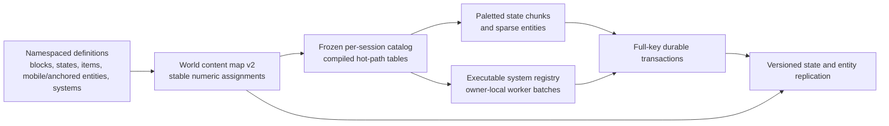

# Growth foundation plan

Status: **execution contract; implementation in progress**. The v5 catalog/ID and receipt work, bounded TCP path, worker-applied fire, durable entity core, live kiln, and versioned public entity replication are implemented. Trusted server startup can now register an entity codec by canonical key, a driverless owner handler, and initial owner values; the handler executes on workers in the live tick. This remains an internal, transient path, not durable world-backed mod execution or a public extension crate. Drops retain a separate allocator, simulation, and checkpoint path despite sharing the registered payload type. The 128-client production-TCP harness passed 300 paced ticks in clustered and spread scenes; the required 15,000-tick combined soaks remain unrun. A frozen three-run fire comparison measured 1.86× median one-to-four-worker speedup with identical hashes, below the required 2×, and the paced real-WAL fire gate remains red. This supersedes the expansion steps in [server-simulation.md](server-simulation.md); that document remains an as-built record and design rationale. The [runtime architecture](runtime-architecture.md) describes the earlier deployed baseline and may lag these intermediate commits. No foundation-complete claim is valid until every exit and acceptance gate below passes.

## Honest starting point

The multithread effort delivered a real 50 Hz coordinator, bounded worker/queue machinery, deterministic movement jobs over immutable voxel views, explicit barriers, off-thread chunk loading and disk/socket I/O, and WAL-gated commits. It did **not** deliver the workload the effort was meant to address: a generally parallel gameplay runtime for heavy future systems. Movement is the only parallel gameplay work; its workers were only 2.71%/3.48% utilized in the documented slowest clustered/spread 16-player [headless baseline](server-simulation.md#measured-server-baseline). Drop motion, durable planning/application, effect consumption, and publication remain coordinator-owned. The startup registry validates metadata, but `BuiltinHandler::from_id` still dispatches a closed set of built-ins. The multithread foundation is **incomplete**, not merely awaiting performance tuning.

The existing boundaries can be reused, but moving only one more low-cost loop to a worker would repeat the mistake. The required outcome is parallel **ownership of substantial world simulation**: many active chunks and entities must execute concurrently, route cross-chunk effects without a serial per-effect loop, and apply disjoint committed changes without funneling every cell through the coordinator. The coordinator remains the clock, admission, and barrier authority; it must not remain the hot-path world executor.

Current content is likewise a partial foundation. `BlockId`, `ItemId`, and texture layers are `u8`; block cells have only an ID, not a state; there are no extensible entity definitions. The byte assumptions cross the catalog, world/chunk cache, sparse edits, inventory, drops, WAL values, protocol, renderer, lighting, UI, and previews. Widening one typedef would be a broken migration. The format changes below are one coherent feature, not a compatibility shim left in the hot path. Two existing durability debts are more than ordinary finite pressure: accepted action receipts have an irreversible one-million-entry lifetime cap, and a dirty drop checkpoint can still construct a full drop snapshot on the tick thread. The server also has a hard 16-client cap and per-connection thread model; a 16-player headless simulation does not prove multiplayer scale.

## Decisions and invariants

1. Use distinct `BlockTypeId(u32)`, `BlockStateId(u32)`, `ItemId(u32)`, and `EntityTypeId(u32)` newtypes. `BlockStateId` is the value in a voxel. A state resolves in constant time to one block type plus precomputed material, collision, opacity, emission, and gameplay flags. Air is state zero; item zero remains invalid. Logical texture/material IDs also cease to be `u8`; GPU layer numbers are a separate implementation detail.
2. A frozen, **per-world/per-connection** `Arc<Catalog>` replaces the process-wide `OnceLock<Catalog>`. Mods and built-ins register namespaced definitions before freeze. `content.map` assigns stable numeric IDs to canonical block, state, and item keys, retains removed IDs as reserved, and never reuses an old ID for a different key. Registration order does not determine save identity. Validate the manifest high-water marks and memory budgets before allocating tables. Workers use dense, read-only lookup tables; no name lookup, property map, lock, or dynamic dispatch occurs per voxel.
3. A block type declares a bounded property schema and legal states. A state's persistent key is the block key plus canonical sorted `property=value` pairs. A missing or changed state fails closed; this release does not upgrade existing world formats or schemas. Placement resolves a state on the **server** from item, orientation, target, and rules. The client can preview but cannot choose an unvalidated world state. Item stacks may carry a bounded, versioned component payload for future tools and other instance data; the empty case remains compact, and only stacks with identical item **and** components can merge. Block stacks remain capped at 128.
4. Normal chunk storage is adaptive: uniform state, `u8` local palette indices, or `u16` local indices when a chunk exceeds 256 unique states. A chunk has only 4,096 cells, so `u16` local indices suffice while global IDs remain `u32`. Branch once per chunk/batch in mesh and light hot loops. Sparse save edits use `(u16 cell_index, u32 state_id)`; wire chunk snapshots use a palette. Measure palette lookup and mesh throughput against today's flat `u8` chunks before accepting the implementation.
5. The entity registry covers **mobile and block-anchored** entities under one stable `EntityId`/`EntityTypeId` lifecycle: type schema, owner, revision, versioned components, active schedule, spatial index, spawn/despawn/transfer, persistence, and bounded public view. It is sparse, not an allocation in every voxel. Drops become a registered mobile entity type; players have session-controlled entity IDs distinct from profile IDs and connection IDs; a kiln is an anchored type with a bounded footprint index in touched chunks. Do not force every entity into a generic per-field ECS or replace specialized hot-path physics with reflective lookups. Placement/removal, inventory transfer, state changes, and footprint changes use full-key WAL transactions; no orphan entity or half-placed structure may survive a crash. Client-visible data is separate from private server payload.
6. The system registry must hold executable handlers as well as descriptors. Built-ins use the same registration path intended for later mods. A handler declares phase, owner partition, read/owned-write domains, dependencies, neighbor radius, and work/effect budgets. Namespaced effect kinds register a validated payload layout, destination rule, and consumer; namespaced persistent-state domains register versioned codecs and recovery/checkpoint handling. Static typed wrappers keep producer code safe while dispatch occurs per owner batch, never per voxel. No handler receives unrestricted mutable `State`, a socket, or a filesystem handle.
7. Partition live gameplay state by stable owner: chunk for cells and anchored block entities, entity ID for independent actors, profile for inventory. Each chunk owner has an `OwnerCell` with its mutable local state and an immutable revisioned read snapshot. A handler computes against frozen `Arc` snapshots and produces a bounded patch; **only the runtime**, after whole-wave validation, takes one exclusive owner lease to apply that patch. No mod handler runs while an owner lock is held, and no code holds two owner locks, a lock across a channel wait, or a global gameplay mutex. Region batching and work stealing may regroup jobs without changing ownership or gameplay order. A hot chunk may split expensive *read-only candidate computation* into subchunk tiles, but its final local mutation remains one ordered owner commit.
8. Bounded queues, one sequential WAL append stream, and occasional backpressure are facts of finite hardware, not proof of failure. They do not justify serializing every local simulation update on the coordinator. Disjoint owner-local work and post-WAL application run in parallel; only conflicting multi-owner transactions require ordered arbitration. Every bound has a visible policy and metric. A subsystem is half-baked if it loses or duplicates state, silently truncates work, depends on worker timing, cannot recover, or cannot be extended without rewriting its core contract.
9. Replace the lifetime receipt ceiling with a safe retirement protocol. A profile has a persisted, monotonic session epoch and ordered action sequence; an epoch grant is durable before actions are admitted. The client explicitly acknowledges contiguous results, including rejections. The server retains unacknowledged outcomes and a retirement high-water mark. A replay below that mark is **rejected as stale, never re-executed**, even after restart. Outstanding receipts remain bounded per profile and can backpressure a non-acknowledging client; successful lifetime play is not capped by a global counter.

## Parallel tick contract

The 50 Hz coordinator cuts off inputs and advances the five logical phases, but does not iterate every active cell or apply every result itself. An active-owner index supplies work; an unloaded or sleeping owner has no per-tick job. At each wave: **freeze** revisioned neighbor views; **prepare** disjoint owner patches and effects on workers; **validate** every result, revision, aggregate budget, and routed destination before any patch in that wave applies; **apply** validated patches on owner workers; then publish new read snapshots at the barrier. This is wave-atomic admission, not a promise that every tick is one giant transaction. Overflow, stale views, validation failure, or a handler panic abort the entire wave **before** apply. An internal apply failure stops the server before publication and requires recovery. There is no full-world copy, per-voxel lock, or global gameplay mutex.

```mermaid
flowchart LR
    CO["Coordinator<br/>clock, admission, barriers"] --> ACTIVE["Active owner index"]
    ACTIVE --> JOBS["Parallel owner jobs<br/>local simulation and plans"]
    JOBS --> ROUTE["Parallel partition and sort<br/>cross-owner effects"]
    ROUTE --> DEST["Parallel destination-owner effect jobs"]
    JOBS --> PLAN["Parallel durable plan and encoding"]
    DEST --> PLAN
    PLAN --> WAL["Batched sequential WAL append and sync"]
    WAL --> APPLY["Parallel disjoint owner apply"]
    APPLY --> LOG["Committed revision logs"]
    LOG --> REP["Interest and replication workers"]
```

Each worker emits bounded effect buffers keyed by `(tick, system, source owner, sequence)`. Routing partitions buffers by destination **in parallel** and sorts within each destination; the coordinator checks batch completion and budgets, not every effect. The destination owner's InteractionCommit job validates and applies its local and remote effects in the same phase. Newly activated work starts at the next tick. One noisy system cannot silently truncate another system's output or monopolize an unbounded queue.

Durable world changes are different from transient simulation. Owner workers prepare validated after-values and full read/write key sets. Disjoint plans proceed together; a canonical conflict pass serializes only overlapping multi-owner transactions. The WAL worker appends/batches records and syncs before any durable value becomes visible. After a successful receipt, disjoint owner commits and revision-log construction execute on workers, followed by one publication barrier. If any in-memory apply fails after WAL sync, stop before publishing and recover from the journal. The sequential disk append is intentional; a serial per-block apply loop is not. Interest projection and packet serialization consume immutable committed revision logs off the tick thread, without redesigning TCP throughput in this slice.

An owner can still be hot: arbitrary native mod code inside one indivisible entity cannot be made parallel by a scheduler. Chunk-local systems therefore expose bounded subchunk candidate jobs for read-heavy work, followed by one owner commit; entity handlers receive per-tick budgets and timing metrics. Public untrusted mod execution needs a sandbox later. This plan promises parallelism for **many active owners and partitionable work**, not magical speedup for a single sequential algorithm.

## Binding technical requirements

### Scheduler, ownership, and effects

- `OwnerKey` has canonical variants for chunk, independent entity, and profile ownership. A cell and anchored block entity have exactly one chunk owner; a drop has exactly one current chunk owner; a player inventory has exactly one profile owner. Ownership is not a worker-thread assignment. Batching may change between ticks, but every active owner receives at most one committed patch per system wave; read-only candidate work may be split into tiles. No worker may look up and mutate a second owner directly.
- The frozen registry defines the complete deterministic phase/wave order. Systems with conflicting access cannot share a wave; ties between independent systems use stable namespaced `SystemId` order. Within a system, owners and candidates have stable keys, and emitted effect sequence numbers come from that deterministic candidate order—not `HashMap` iteration or worker completion order. One versus many workers must produce byte-identical committed owner state and effect order for the same inputs.
- Worker inputs are owned job metadata plus immutable `Arc` snapshots and their revisions. A chunk-load completion or durable edit arriving during a wave is installed only at a later barrier; stale job results are discarded and rescheduled. A missing authoritative chunk defers the affected work and requests a load. The client procedural baseline is never a server read substitute.
- Each job returns a bounded `OwnerPatch`, effects, and durable intents without mutating live state. The runtime validates **all** jobs and routed effects in a wave before applying any patch in that wave. Applying a patch runs trusted, infallible runtime code only; a handler cannot run or reenter during apply. Any impossible internal apply error is fatal before publication. Read snapshots for the next wave are published only after all owner applies finish.
- Routing partitions effects by destination on workers, then sorts each destination by `(tick, phase wave, system ID, source owner, producer sequence)`. Local and remote effects take the same route. A destination handler may create a **new** intent, but may not recursively execute another propagation step in the same tick. Persistent effects are not visible merely because routing succeeded; they follow the WAL rule below.
- Admission is explicit. The scheduler reserves declared per-job, per-system, and per-phase output budgets **before** running a wave. If normal active work exceeds capacity, it selects a deterministic prefix of owner/candidate keys starting at a **persisted round-robin cursor**, retains the remainder in a persisted scheduled backlog, advances the cursor only after successful commit, and reports lag; low-key owners cannot starve high-key owners. It does not execute a partial unvalidated wave or silently drop effects. A handler exceeding its declared bound is a defect: abort that wave and fail closed. A client command that cannot be admitted gets an explicit retryable rejection, never a silent success.
- Retain the current initial ceilings of 4,096 effects per producer, 4,096 per destination owner, and 16,384 deliveries per batch, plus 16,384 jobs per phase; compute admission from **expanded destination deliveries**, not merely emitted effect count. Any raised ceiling requires measured memory and tick-cost evidence. These are scheduler budgets, not permission to truncate a valid fire frontier.
- A fire frontier is a deduplicated, bounded per-chunk cell set, not an unbounded event list. A delayed entry keeps its original scheduled tick and executes once when admitted; overload may delay simulation but may not erase or duplicate it. An effect targeting an unloaded chunk is durably pending by destination key, requests an authoritative load, and is delivered once after that load; if its pending budget is full, the source wave waits rather than guessing terrain or dropping the effect. An owner with an unacknowledged fire-frontier WAL update may not advance that frontier again.
- No owner lock is held during handler code, network or disk I/O, WAL sync, channel send/receive, or a phase barrier. Owner leases are acquired in canonical order for the runtime's short apply step, with no nested owner locks. Use sparse patches and new snapshots only for changed owners; no full-world clone and no name/property decoding inside voxel loops.

### Durable visibility, recovery, and overloaded work

- Classify every state field as transient, checkpointed, or WAL-durable in its owning module. Drop motion is checkpointed and may resume at its last captured position; drop identity/count, inventory, block states, block-entity lifecycle/payload, and scheduled fire frontier are WAL-durable. A routed ignition at tick `T` is a **proposal**: it may be validated at `T`'s interaction barrier, but the destination does not become active and no block changes until a successful WAL receipt at a later durable phase. The same timing applies across and within chunks; it first propagates on a subsequent tick after commit.
- A persistent effect has a stable `(tick, system, source owner, producer sequence)` identity. Consuming a source frontier entry and recording its destination ignition or unloaded-chunk pending entry are one WAL transaction; replay or retry cannot clear the source without retaining the destination. Destination mailboxes use **source-scoped keys**, not one shared per-chunk key, so independent fire sources do not become a single conflict chain. Batch effects by source/destination within the WAL record limit. When the destination becomes authoritative, consuming pending entries and activating its frontier are likewise atomic. Registered effect kinds state an explicit dedup/merge rule; the default is ordered delivery without implicit deduplication.
- A durable action declares its full sorted read/write `StateKey` set and expected revisions before WAL submission. Owner workers may prepare and encode disjoint actions concurrently; workers partition keys and identify collision groups, while the coordinator orders only actual overlapping groups. Do not sort or apply every fire cell on the coordinator. Reject any action whose complete encoded record exceeds the existing 1 MiB WAL record limit **before** submission. Batch independent records for one sync without merging their atomic identities. No block, inventory, drop, or entity ownership is applied, acknowledged, or replicated before its own sync receipt.
- On receipt, apply disjoint owner slices on workers behind one visibility barrier. A multi-owner transaction is visible entirely or not at all. If a WAL-synced apply fails, close all clients and stop before publishing; startup recovery must redo the exact `after` values. A WAL failure, missing receipt channel, invalid checkpoint, unknown required persistent domain, or failed authoritative chunk load likewise stops the server rather than continuing with uncertain state.
- Registered persistent domains must participate in **validation, replay, checkpoint, and WAL rotation/compaction**. Recovery first validates *every* candidate and current checkpoint, then writes any repairs; an unknown domain or schema never gets skipped or erased. Backpressure from a full WAL/checkpoint queue leaves actions unapplied and retriable. Journal rotation must not discard a domain's last committed value or a scheduled frontier.
- The session/sequence receipt floor must be persisted atomically with action outcomes; old epochs cannot be accepted again after reconnect or restart. Acknowledging and retiring a receipt can shrink storage, but never lower the replay floor. Test rejected as well as accepted results. A full per-profile unacknowledged window pauses new actions for that profile, not all players.

### Exact content and protocol cutover

These are initial **admission limits**, not numeric-ID widths. Raising a limit later requires a memory/performance check, not a save-format migration:

| Limit | Required value and behavior |
| --- | --- |
| Logical definitions | At most 32,768 block types, 131,072 states, 32,768 items, 32,768 entity types, and 8,192 logical textures per world; reject larger catalogs before allocation. IDs remain `u32`. |
| Assigned-ID high-water | At most 1,048,576 in each mapped kind, including tombstones; reject a sparse or hostile map before dense table allocation. Numeric width remains `u32` so raising this resource limit later does not change saves. |
| State schema | At most eight properties and 4,096 legal states per block. Canonical block/item keys ≤255 UTF-8 bytes; canonical state keys ≤512 bytes. Reject duplicate property names/values and state explosion at registration. |
| Manifest and frames | `content.map`/handshake manifest ≤64 MiB, streamed in bounded parts. Wire v8 frame payload ≤64 KiB; no decoder allocates from an unchecked length. One client outbound queue retains at most 128 frames **and** 2 MiB of encoded bytes. |
| Item and entity payloads | Optional item-stack components ≤1 KiB; one entity private payload ≤64 KiB; total resident private entity payload per chunk ≤2 MiB. One public entity view ≤4 KiB and total public views assembled for a chunk ≤1 MiB. A transaction must also fit the WAL limit. |
| Snapshot assembly | At most 2 MiB buffered per chunk; chunk states and public entity pages carry one revision/transaction epoch and checksum and install atomically. Missing, repeated, mixed-epoch, or oversized pages cause resync/disconnect, never partial installation. |
| Player and network admission | Default capacity 128 concurrent players, configurable hard cap 256; an admission slot is reserved before session/interest allocation. Per-client outbound limits are 128 frames and 2 MiB; the aggregate encoded outbound limit is 128 MiB. At a full limit, reject or disconnect explicitly, never let one client stall others or grow an unbounded queue. The measured acceptance target is 128 real TCP clients, not an unmeasured claim that 256 perform equally well. |

`content.map` v2 is checksummed and binds `(kind: u8, ID: u32)` to a length-delimited namespaced canonical key and schema fingerprint for block types, states, items, and entity types; its entry count is `u32`, not the current `u16`. IDs are monotonic and tombstoned, never recycled. Existing builtin block/item numeric assignments and each builtin's default state meaning are preserved. The server resolves the map **before** freezing its per-world catalog. A client first receives the server's bounded mapping and schema/behavior/material fingerprint, resolves local definitions against it, sends `ContentReady`, and only then may receive `Welcome`, chunks, or inventory. A mismatch aborts the connection. No process-global builtin catalog fallback is allowed in production.

Wire v8 encodes `u32` item, state, and entity type IDs. A chunk cell snapshot is paletted and may be paged; public entity views use bounded continuation pages under the same snapshot epoch. Client assembly is atomic and revision-checked. State and entity deltas have independent revisions and request resync on a gap; the interested subset of deltas from one durable transaction carries one commit ID and installs together, so a client never sees half a kiln transaction in its view. A late page or delta cannot resurrect a removed entity. Private entity inventory is sent only to its authorized viewer, never in an interest broadcast. A world drop retains the **full** item-stack component payload server-side through drop, WAL, checkpoint, pickup, and restart; the broadcast carries only its bounded public view. Item-stack equality and merging include canonical component bytes, while blocks retain the 128-count cap.

Save-format versions are independent of terrain-generator version. `world-v5/` uses `BGCM` v2, `BGED` v3, `BGIN` v2, `BGDP` v2, and versioned entity/owner snapshots; the existing generic WAL frame may remain v1 **only if its framing and checksums are unchanged**, while all widened domain-value codecs are versioned. Old and new domain values must never be mixed in one world. New server binaries hold an exclusive save lock for their lifetime. This foundation targets new v5 worlds: incompatible older saves are rejected with a clear error, never opened, modified, or upgraded implicitly. There is no v4 conversion tool in this release.

Before changing a codec, specify its byte layout and version in its owning module, with golden valid/invalid fixtures for supported formats. Every wire/save decoder checks lengths, counts, integer conversions, and checksums **before** allocating or indexing; malformed input returns an error, never a panic or truncated value. Tests cover truncated, duplicate, reordered, oversized, and checksum-invalid records. Normal v5 startup rejects older formats and does not auto-upgrade a save.

### Generic entities and publication

- `EntityId` is a persisted, monotonic `u64` allocator and is never reused. An entity record contains its namespaced type, schema version, ID, owner, revision, validated private payload, and bounded public view. An anchored entity additionally has an anchor and footprint; its anchor owner stores the record and other chunks store only footprint references. A mobile entity has a position and one spatial owner, with a deterministic barrier transfer on chunk crossing. A state/footprint mismatch, duplicate ID, missing anchor, invalid spatial owner, or unknown required type fails load without deleting bytes.
- Loading a chunk with a footprint reference must resolve and validate the anchor record from authoritative storage before that footprint is interactable or replicated. If the anchor is not resident, request it asynchronously and defer the chunk's affected interaction/public view; never create a second local entity or treat an unresolved reference as empty space.
- Creating, breaking, moving, or changing an entity and all affected block states, footprint indexes, inventory slots, and item ownership is one declared full-key transaction for WAL-durable fields. Checkpointed position/motion uses a bounded revisioned snapshot and a defined restart rollback window, never changes item ownership without WAL. It is planned from authoritative resident chunks; absent chunks defer. The transaction is rejected before WAL if any placement, collision, footprint, payload, inventory, or record-size bound fails. Breaking either half of the proof kiln removes the whole structure once and conserves its items.
- Drops migrate to one registered mobile entity type; players have session-controlled entity IDs distinct from stable profile IDs and connection IDs. Player public position and appearance replicate to other interested clients as remote avatars; inventory and session data remain private. A disconnect/reconnect transfers session control without creating a second profile inventory, and despawn cannot drop or duplicate player-owned items. Mobile entity state is owner-batched, not a global drop/player scan.
- Ticking uses the same active-owner index as fire, not a global entity scan. Scheduled state survives unload/reload. Only committed public state enters revision logs; replication workers perform interest projection from those immutable logs, while socket writers still own serialization. The client may animate but never decide a machine's fuel, progress, or inventory.

## Execution sequence

Steps 1–4 form one foundation release gate, ordered to avoid building the owner store around soon-to-be-replaced byte IDs. No intermediate step is a completed foundation, and optional content polish must not delay the parallel fire proof or real-client scale proof. New mod-heavy gameplay should not accumulate on the current coordinator while this migration is in progress. Each step must remain buildable and recoverable at its own commit boundary.

### 1. Widen identities and introduce block states as one vertical format transition

- Build the new content resolver before world open: load candidate definitions, read/validate the world manifest, retain existing assignments, allocate new IDs monotonically, compile state tables, then freeze the catalog. In multiplayer, the server sends the bounded content assignment/schema manifest during handshake; the client resolves its local definitions to **that world's IDs** before decoding gameplay snapshots. Reject missing definitions or schema mismatches. Keep the catalog immutable during play; hot reload is not part of this plan.
- Replace `u8` IDs through authoritative state and all consumers: world generation and chunks, `PreparedEdit`/deltas, loot, inventory and drops, UI, raycast, lighting, meshing, material selection, previews, tests, and protocol. Remove hard-coded 256-entry catalog tables and casts that truncate IDs. Keep `u8` only where it genuinely means a local palette index, an inventory slot, or a GPU-local layer. Logical texture IDs become wide; resolve them at catalog freeze to physical GPU page/layer handles and group mesh work by page rather than demanding one giant texture array.
- Add canonical state registration and compiled state properties. First built-in proof: orientable wood logs with `axis=x|y|z`, using the existing vertical log as the default state. Test all orientations at a chunk seam, including negative coordinates; a state must survive save/restart and replicate to another client. Existing terrain generation keeps its default states. Introduce optional versioned stack components in the same inventory/drop migration, with an empty fast path and exact component-aware merge rules.
- Version each affected format instead of reinterpreting old bytes: `content.map` v2; sparse chunk overrides (`BGED`) v3; inventory (`BGIN`) v2; drops (`BGDP`) v2; widened WAL owner values and receipt codecs; and wire v8. Keep established builtin numeric IDs assigned to the same meanings in new v5 worlds; do not reuse an ID for different content. Make framing accommodate a worst-case 4,096-state chunk palette under the 64 KiB frame cap, and add the **2 MiB byte** budget alongside outbound frame counts so a larger frame cannot multiply queue memory silently. Step 4 then proves the resulting transport under real client load.
- Use that protocol/save version change to implement the session/sequence/action-result acknowledgement contract. Persist the replay floor and pending results with the same WAL/checkpoint discipline as inventories. Do not delete an old receipt merely because it is old or because a time-to-live expired. A reconnect may retry unacknowledged actions from its still-valid session; starting a newer server-issued session closes older epochs and requires authoritative resync, never reapplication of an old action.
- Move default new-format saves to `world-v5/` for new worlds. Keep save-format version separate from terrain-generator version and reject an older or mismatched world before altering its files. There is no v4 upgrade path in this release; development checks use isolated temporary v5 saves and never modify local older world directories. New wire clients cannot submit legacy action IDs.

**Step 1 exit:** a v5 dedicated server and client complete real loopback content negotiation and authoritative streaming; incompatible older saves fail closed without modification; IDs above 255 survive every save/wire/render path; a source audit finds no `u8` content identity except true local indices. Do not call a typedef-only compile pass complete.

### 2. Deliver the missing parallel gameplay runtime

- Refactor the global world/drop state into chunk `OwnerCell`s, independent entity owners, and profile owners. Owner cells carry sparse active/scheduled work and immutable revisioned neighbor snapshots. The scheduler hands disjoint owner leases to bounded worker batches; no central `State` iteration performs a mod's per-cell work. Preserve the current fixed-step clock and phase barriers.
- Replace `BuiltinHandler::from_id` with a frozen mapping from `SystemId` to executable handler plus descriptor. Keep the five logical phases and deterministic `(tick, source, sequence)` command order. One module registers each built-in; adding a built-in must not require editing a central match statement or the coordinator event loop. Registration rejects cycles, conflicting writes without order, unsupported partitions, unbounded neighborhoods, and handlers without a runtime implementation.
- Implement the owner-batch scratch/validate/apply contract and parallel effect routing described above. Register effect kinds and persistent state domains with handlers/codecs instead of adding central enum or recovery `match` arms for each feature. Apply independent owner results on workers, not in a coordinator loop. Publish only after the entire phase/barrier succeeds.
- Parallelize owner-local durable planning, after-value encoding, post-WAL apply, and revision-log construction. Keep transaction key reservations and overlap arbitration canonical. Batch independent WAL submissions so one action need not imply one sync; never acknowledge or expose a durable change before its receipt. Multi-owner transactions remain atomic to clients even when their disjoint owner slices apply concurrently behind a barrier.
- Migrate drops to the generic mobile-entity registration and move their physics to owner batches with stable IDs and one owner at a time. Transfer a moving drop across a chunk boundary only at a barrier; keep ownership/count/expiry WAL rules unchanged. This is a useful migration exercise, **not** the performance proof for mod-heavy gameplay. Register player entity type and its public view through the same path, while session movement authority and stable profile inventory remain separate.
- Replace full-set drop checkpoint capture/sort on the coordinator with bounded, revisioned owner snapshots submitted to checkpoint workers. A dense owner may be split into bounded batches without changing its gameplay identity. WAL still gates item ownership; motion checkpoints may lag under a stated restart policy. A stale checkpoint receipt cannot clear newer dirty state. No tick performs work proportional to *all* world drops merely because one drop moved.
- Implement **fire propagation** as the proof workload on this same API, not as a coordinator special case: active cell frontiers, one spread step per tick, cross-chunk ignition effects, durable block changes before publication, and explicit unload/reload persistence. Cover dense fronts spread across many chunks and a concentrated hot chunk. Keep region grouping a scheduling optimization, never a gameplay boundary. If fire's cost, effect routing, or committed block application falls back to one hot coordinator loop, this phase fails.
- Fire uses a fixed neighbor order and counter-based randomness derived from `(world seed, scheduled tick, source cell, neighbor direction)`, never a shared or thread-local RNG. Flammability comes from compiled state properties; the first rule set burns wood/leaves/grass, does not burn stone/bedrock, and changes a consumed block only after WAL commit. A pending effect into an unloaded chunk waits for authoritative terrain. These rules are part of the determinism test, not left to worker completion order.
- Record per-system and per-owner job CPU, output counts, queue saturation, routing time, barrier wait, WAL plan/apply cost, and coordinator CPU share. A slow trusted native handler is observable and can have later work throttled or disabled, but cannot be preempted safely mid-call; the eventual public sandbox is a separate security task.

**Step 2 exit:** the real fire feature, not movement/drops, passes deterministic cross-chunk and restart checks, saturating-queue behavior, the one-versus-four-worker compute gate, and the paced real-WAL soak. The coordinator has no per-cell fire loop, per-effect router loop, or serial per-block post-WAL apply path.

### 3. Complete generic entity lifecycle and prove anchored behavior with gameplay

- Register namespaced entity types with a schema version, validated codec, ownership mode (mobile or anchored), state compatibility where anchored, max payload/footprint, tick policy, and public-view encoder. Keep payloads decoded in memory; serialization happens for persistence and publication, not on every block query. Unknown required types or invalid payloads fail world load without deleting data; there is no entity-schema upgrade path in this release.
- Store entities sparsely by anchor and index their footprints in touched chunks. A chunk snapshot provides consistent block states plus relevant public entity views; later entity create/update/remove messages carry IDs and revisions. Resync reconstructs both. Private inventories and server-only data never leak in a chunk broadcast.
- Use the full-key durable transaction path for entity create/remove/update and any linked block/inventory changes. A normal block edit touching an entity's anchor or footprint invokes its registered transaction policy. Unloading/reloading preserves scheduled work and cannot create two owners. Recovery verifies no dangling footprint or mismatched anchor/state.
- Ship a real proof feature, not a fake test entity: a two-block kiln that can straddle a chunk seam, with facing and lit block states plus an anchor-owned inventory, fuel, and progress. Placement, ticking, interaction, breaking either half, saving, restart, and two-client replication must all maintain one coherent kiln. If the feature exposes missing API capability, fix the API before adding another feature-specific bypass.

**Step 3 exit:** kiln placement/breakage and active ticking pass cross-seam, two-client, fault-injected WAL/restart, privacy, and visual checks without adding a central dispatch branch. Mobile drops and player public entities use the same type/ownership/revision/replication contract; the game renders remote players. This does not yet clear the combined foundation gate.

### 4. Scale the real multiplayer path beyond the former 16-client ceiling

- Replace the hard 16-client cap with configurable admission (default 128, hard cap 256) **and** remove the one-reader-plus-one-writer-thread-per-connection scaling assumption. Use a bounded nonblocking socket reactor (for example `mio`) plus fixed worker pools for frame decode/encode and gameplay projection. Handshake, content-map assembly, authentication/profile load, and chunk generation must not block a reactor. Partial reads/writes, EOF, `WouldBlock`, frame limits, and reconnect are explicit state transitions; a stalled peer cannot consume a tick worker or reactor indefinitely.
- Add bounded, fair per-client and aggregate network budgets. Reliable ordered action results, inventory, block/entity deltas, and commit groups are never silently coalesced or lost. Only explicitly replaceable snapshots (for example position) may coalesce by entity/revision. When a slow client exceeds its byte or frame budget, disconnect it with a recoverable resync path; never stall or drop committed state for other clients. Report inbound/outbound bytes, queue depth, send age, disconnect reason, and interest lag.
- Make interest projection incremental from committed revisions. Use shared immutable encoded chunk pages across clients where content/epoch match, bounded per-client cursors, and fair round-robin chunk/delta scheduling; do not rebuild or scan the whole world for each client each tick. The chunk cache must admit at least 65,536 distinct resident chunks under an explicit memory cap and interest pinning, rather than assuming 16 clustered players fit the current 16,384-slot cache. If capacity is unavailable, negotiate a reduced authoritative view distance and pause new chunk demand; never silently drop a subscribed chunk or substitute client terrain as authority. Loading and eviction stay off the tick and socket threads.
- Size movement and publication work queues from the configured player cap and measured peak occupancy, with bounded backpressure and per-player fairness. Preserve server authority and stable profile inventory across 128 active sessions. Remote-player spawn/move/despawn messages use entity IDs and revisioned interest; the local player is reconciled separately. Exercise clustered and spread interests, edits, drops, fire, and seam-crossing kilns with real network clients, not just fake coordinator inputs.

**Step 4 exit:** 128 simultaneous real loopback TCP clients complete content negotiation, spawn, movement, actions, interest streaming, and reconnect through the production listener for a 15,000-tick paced real-WAL soak. No hardcoded 16-client branch remains. Slow and malformed clients are isolated, queue memory stays within declared limits, and tick latency meets the acceptance budget. The configurable hard cap of 256 is a capacity guard, not an unmeasured throughput claim.

### 5. Acceptance gate before calling this foundation complete

| Contract | Evidence required |
| --- | --- |
| New-format data is safe | On isolated temporary v5 saves, restart after edits, inventories, drops, entity changes, and pending recovered WAL effects; compare logical content before/after. Reject corrupted, unknown, and older formats without changing their bytes. Include interrupted commit/restart and fail-closed partial-directory checks; never run development checks on `world-v3/` or `world-v4/`. |
| Receipts do not expire into duplication or a lifetime stop | Exercise a small configured outstanding window, acknowledgement, reconnect, stale replay, and restart. Show retired keys can never execute again and unacknowledged keys retain their result. Soak beyond the former lifetime cap without unbounded receipt growth. |
| IDs and states do not truncate | Register IDs 255, 256, and above 65,535, plus more than 256 states of one block; round-trip catalog, chunk, edit, inventory, drop, WAL, wire, rendering, and restart. Exercise the chunk-palette 255→256 upgrade and a 4,096-unique-state chunk. Verify differently-componented item stacks never merge and component data survives pickup/restart. Missing IDs, invalid schemas, and hostile high-water marks fail closed. |
| Transactions conserve state | Place/break the kiln across positive and negative chunk seams; transfer mobile drops between owner chunks; inject failures before and after WAL sync and checkpoint; prove no half structure, orphan entity, duplicated item, or lost inventory. Preserve the 128-block stack cap. |
| Scheduling is deterministic | Run movement, dense drops, fire fronts, entity ticks, and cross-chunk effects with one and four workers, deliberately shuffled job completion, and a controlled logical WAL-receipt schedule; compare exact owner-state and revision-log hashes by tick. Force effect, WAL, loader, and outbound saturation; verify deterministic deferral/rejection, no partial wave, and no lost scheduled work. Missing authoritative chunks must defer. Real disk receipts may arrive on different ticks and are tested for eventual consistency separately. |
| Extension path is real | Fire, drops, players, and the kiln register through focused modules. Adding their system/effect/persistent-domain behavior must not add an ID `match` to `runtime.rs`, `builtins.rs`, or recovery. Their checkpoints survive WAL rotation; unknown required domains stop startup. A startup extension crate can register one new block state, item with components, mobile entity, anchored entity, system, and durable effect without editing core code; an integration test proves each saves/replicates/recovers. |
| Client/server lifecycle is real | Exercise the production nonblocking listener with a loopback TCP client on an isolated save: content negotiation before ordered `Welcome`, idle connection, chunk/delta/entity streaming, WAL-acknowledged action, resync, restart, and slow-client isolation. Run a release server/client smoke. Compilation or a blocking test listener is not acceptance. |
| Multiplayer scale is real | Run 128 actual loopback TCP clients through the production listener for 15,000 paced ticks in both clustered and spread scenes. Each completes handshake, spawn, movement, and interest updates; a rotating subset edits, picks up drops, and interacts with kilns/fire. Include 16 slow/malformed peers and reconnect churn without affecting healthy peers. Measure per-client and aggregate queue bytes, network CPU, player admission, chunk-cache residency/pins, received revision gaps, and action-to-ack latency. Zero unauthorized/duplicated commits, lost deltas, or unbounded queues. Report p95/p99 tick latency; a headless fake-client result cannot substitute. |
| Parallelism is real | On a host with at least four cores, compare one and four workers on identical frozen multi-chunk fire inputs through the production handler, router, and owner-apply path (not a toy arithmetic loop), with three measured runs. Exclude WAL waits and fixture rebuild from the timed compute region. Require at least 2× lower median Simulation/Interaction **compute** time with identical output hashes; report coordinator CPU share and routing/apply time separately. Also measure one hot chunk so a serial owner bottleneck is visible rather than hidden in the spread result. Moving movement or drops alone cannot satisfy this gate. |
| Performance remains viable | On the same reference host and scene, compare old/new resident bytes, mesh/light time, GPU upload/render time, tick p50/p95/p99, backlog, barrier wait, WAL latency, checkpoint capture, and queue bytes. Add dense fire, drops, and seam-crossing kilns to clustered/spread 16-player baseline scenes and 128-player production-TCP scenes. Require tick CPU p95 ≤15 ms and p99 ≤20 ms, no backlog run longer than one second, no upward queue-depth trend between the first and last 1,000 steady ticks, and completed WAL rotation through a 15,000-tick soak; investigate any material regression before shipping. The client 60 FPS target needs a separate live modest-GPU check. |

Run `cargo test`, `cargo fmt --all -- --check`, and `cargo clippy --all-targets --all-features -- -D warnings` after each slice. Preserve `server-perf [steady-ticks]`; add `server-perf fire-cpu --workers <N> --iterations 3000` for matched frozen-input compute comparison, `server-perf fire <measured-ticks> --warmup 300` for paced **real-WAL** gameplay, and a production-listener `server-perf tcp --clients 128 --ticks 15000 --scene clustered|spread` with actual sockets. Raise the current 10,000-tick ceiling to allow a 15,000-tick soak. The fire fixture uses isolated saves and a deterministic forest across at least 128 active chunks; the real-WAL scenario uses recurring in-game ignition to hold 8,000–16,000 active frontier cells and reports admitted/deferred work. Force at least one checkpoint-gated WAL rotation in the isolated soak through a test-specific trigger, without weakening production limits. The compute scenario reuses the production handler/router/apply functions, counts the same candidates/effects for both worker settings, and reports output hashes; fixture reset is outside the timed region. The real-WAL soak checks conservation, eventual state after draining receipts, and 50 Hz backlog—not same-tick hashes that asynchronous disk timing cannot guarantee. Keep the existing clustered/spread baseline for regression comparison. Rendering/state changes also require inspected headless visual previews and `cargo run --release -- perf 300 6`; inspect generated images when the window is unavailable. No test is added merely to inflate a count: each acceptance case above protects a concrete failure mode.

Implement in focused modules: catalog/state and codecs under `src/content/`, `src/world/`, `src/storage/`, and `src/protocol/`; owner scheduling/effects/durability under `src/server/`; entity types and fire behavior in focused server modules; client reconciliation and revision handling under `src/client/`; materials and state meshing under `src/render/`; transport reactor and interest workers under `src/server/net/`. `server.rs`, `runtime.rs`, and the central event loop remain orchestration, not repositories for feature logic. Commit each buildable vertical slice with its tests and evidence; an incomplete intermediate commit is not a claim that the foundation gate passed.

## Explicitly deferred

- Transport compression and internet/WAN latency optimization. The 128-real-client TCP reactor, prioritization, admission, and measured capacity are **not** deferred. Do not claim 256-player performance without measuring it, and do not cite the fake-client benchmark as real network proof.
- Public mod packaging, scripting, native-plugin sandboxing, asset download, and live hot-reload. The internal catalog/system/entity registration contract must already be usable by built-ins and by a startup extension crate; public loading is a later surface on the same contract, not a reason to keep hard-coded dispatch now.
- Eliminating the logical coordinator or the sequential WAL append. The coordinator remains clock/barrier/conflict authority, but owner-local planning, simulation, effect routing, post-WAL application, and publication projection must not be serialized through it. Only genuinely overlapping multi-owner conflicts use ordered arbitration.

The plan is complete only when a new stateful block, item with components, mobile entity, cross-chunk anchored entity, and computationally substantial system can be added in focused modules, saved/recovered, replicated, and scheduled without altering core protocol IDs by hand or adding another central gameplay switch; the fire workload demonstrably scales across workers; and 128 real network clients meet the stated correctness and latency gates. The final implementation commit must contain the evidence, not merely a claim of architectural readiness.
