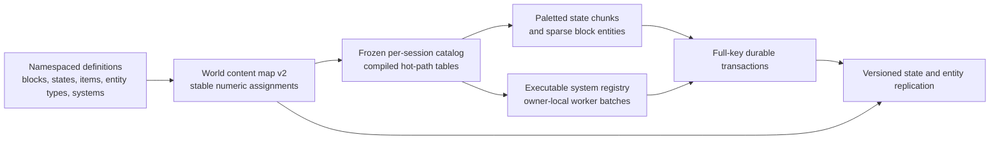

# Growth foundation plan

Status: **proposed execution plan, not implemented work**. This supersedes the expansion steps in [server-simulation.md](server-simulation.md); that document remains an as-built record and design rationale. The [runtime architecture](runtime-architecture.md) describes the code that runs today.

## Honest starting point

The multithread effort delivered a real 50 Hz coordinator, bounded worker/queue machinery, deterministic movement jobs over immutable voxel views, explicit barriers, off-thread chunk loading and disk/socket I/O, and WAL-gated commits. It did **not** deliver the workload the effort was meant to address: a generally parallel gameplay runtime for heavy future systems. Movement is the only parallel gameplay work; its workers were only 2.71%/3.48% utilized in the documented slowest clustered/spread 16-player [headless baseline](server-simulation.md#measured-server-baseline). Drop motion, durable planning/application, effect consumption, and publication remain coordinator-owned. The startup registry validates metadata, but `BuiltinHandler::from_id` still dispatches a closed set of built-ins. The multithread foundation is **incomplete**, not merely awaiting performance tuning.

The existing boundaries can be reused, but moving only one more low-cost loop to a worker would repeat the mistake. The required outcome is parallel **ownership of substantial world simulation**: many active chunks and block entities must execute concurrently, route cross-chunk effects without a serial per-effect loop, and apply disjoint committed changes without funneling every cell through the coordinator. The coordinator remains the clock, admission, and barrier authority; it must not remain the hot-path world executor.

Current content is likewise a partial foundation. `BlockId`, `ItemId`, and texture layers are `u8`; block cells have only an ID, not a state; there are no block entities. The byte assumptions cross the catalog, world/chunk cache, sparse edits, inventory, drops, WAL values, protocol, renderer, lighting, UI, and previews. Widening one typedef would be a broken migration. The format changes below are one coherent feature, not a compatibility shim left in the hot path. Two existing durability debts are more than ordinary finite pressure: accepted action receipts have an irreversible one-million-entry lifetime cap, and a dirty drop checkpoint can still construct a full drop snapshot on the tick thread.

## Decisions and invariants

1. Use distinct `BlockTypeId(u32)`, `BlockStateId(u32)`, and `ItemId(u32)` newtypes. `BlockStateId` is the value in a voxel. A state resolves in constant time to one block type plus precomputed material, collision, opacity, emission, and gameplay flags. Air is state zero; item zero remains invalid. Logical texture/material IDs also cease to be `u8`; GPU layer numbers are a separate implementation detail.
2. A frozen, **per-world/per-connection** `Arc<Catalog>` replaces the process-wide `OnceLock<Catalog>`. Mods and built-ins register namespaced definitions before freeze. `content.map` assigns stable numeric IDs to canonical block, state, and item keys, retains removed IDs as reserved, and never reuses an old ID for a different key. Registration order does not determine save identity. Validate the manifest high-water marks and memory budgets before allocating tables. Workers use dense, read-only lookup tables; no name lookup, property map, lock, or dynamic dispatch occurs per voxel.
3. A block type declares a bounded property schema and legal states. A state's persistent key is the block key plus canonical sorted `property=value` pairs. State schema changes require an explicit migration; a missing or changed state is an error, not air or a guessed default. Placement resolves a state on the **server** from item, orientation, target, and rules. The client can preview but cannot choose an unvalidated world state. Item stacks may carry a bounded, versioned component payload for future tools and other instance data; the empty case remains compact, and only stacks with identical item **and** components can merge. Block stacks remain capped at 128.
4. Normal chunk storage is adaptive: uniform state, `u8` local palette indices, or `u16` local indices when a chunk exceeds 256 unique states. A chunk has only 4,096 cells, so `u16` local indices suffice while global IDs remain `u32`. Branch once per chunk/batch in mesh and light hot loops. Sparse save edits use `(u16 cell_index, u32 state_id)`; wire chunk snapshots use a palette. Measure palette lookup and mesh throughput against today's flat `u8` chunks before accepting the implementation.
5. Block entities are sparse records, **not** another allocation inside every voxel: stable `EntityId`, namespaced type, anchor/owner chunk, revision, versioned payload, and optional bounded footprint index in touched chunks. The anchor owns state and lifecycle. Placement/removal, inventory transfer, state changes, and footprint changes share the existing full-key WAL transaction path; no orphan entity or half-placed structure may survive a crash. Client-visible data is separate from private server payload.
6. The system registry must hold executable handlers as well as descriptors. Built-ins use the same registration path intended for later mods. A handler declares phase, owner partition, read/owned-write domains, dependencies, neighbor radius, and work/effect budgets. Namespaced effect kinds register a validated payload layout, destination rule, and consumer; namespaced persistent-state domains register versioned codecs and recovery/checkpoint handling. Static typed wrappers keep producer code safe while dispatch occurs per owner batch, never per voxel. No handler receives unrestricted mutable `State`, a socket, or a filesystem handle.
7. Partition live gameplay state by stable owner: chunk for cells and anchored block entities, entity ID for independent actors, profile for inventory. Each chunk owner has an `OwnerCell` with its mutable local state and an immutable revisioned read snapshot. The scheduler grants one exclusive owner lease per phase wave; worker tasks hold that owner's lock once per **batch**, with no global gameplay mutex or cross-owner nested lock. Read-only neighbor snapshots are shared `Arc`s. Region batching and work stealing may regroup jobs without changing ownership or gameplay order. A hot chunk may split expensive *read-only candidate computation* into subchunk tiles, but its final local mutation remains one ordered owner commit.
8. Bounded queues, one sequential WAL append stream, and occasional backpressure are facts of finite hardware, not proof of failure. They do not justify serializing every local simulation update on the coordinator. Disjoint owner-local work and post-WAL application run in parallel; only conflicting multi-owner transactions require ordered arbitration. Every bound has a visible policy and metric. A subsystem is half-baked if it loses or duplicates state, silently truncates work, depends on worker timing, cannot recover, or cannot be extended without rewriting its core contract.
9. Replace the lifetime receipt ceiling with a safe retirement protocol. A profile has a persisted, monotonic session epoch and ordered action sequence; an epoch grant is durable before actions are admitted. The client explicitly acknowledges contiguous results, including rejections. The server retains unacknowledged outcomes and a retirement high-water mark. A replay below that mark is **rejected as stale, never re-executed**, even after restart. Outstanding receipts remain bounded per profile and can backpressure a non-acknowledging client; successful lifetime play is not capped by a global counter.

## Parallel tick contract

The 50 Hz coordinator cuts off inputs and advances the five logical phases, but does not iterate every active cell or apply every result itself. An active-owner index supplies work; an unloaded or sleeping owner has no per-tick job. Each phase freezes revisioned neighbor views, schedules disjoint owner batches on the existing worker pool, and waits at a barrier. A job stages bounded local changes in scratch and validates its complete output before the runtime applies that owner's transient changes under its exclusive lease. Overflow, stale views, validation failure, or a handler panic abort **before** apply; no mod handler runs during apply. An internal apply failure stops the server before publication. There is no full-world copy, per-voxel lock, or global gameplay mutex.

```mermaid
flowchart LR
    CO["Coordinator<br/>clock, admission, barriers"] --> ACTIVE["Active owner index"]
    ACTIVE --> JOBS["Parallel owner jobs<br/>local simulation and plans"]
    JOBS --> ROUTE["Parallel partition and sort<br/>cross-owner effects"]
    ROUTE --> DEST["Parallel destination-owner effect jobs"]
    JOBS --> PLAN["Parallel durable plan and encoding"]
    DEST --> PLAN
    PLAN --> WAL["Batched sequential WAL append and sync"]
    WAL --> APPLY["Parallel disjoint owner apply"]
    APPLY --> LOG["Committed revision logs"]
    LOG --> REP["Interest and replication workers"]
```

Each worker emits bounded effect buffers keyed by `(tick, system, source owner, sequence)`. Routing partitions buffers by destination **in parallel** and sorts within each destination; the coordinator checks batch completion and budgets, not every effect. The destination owner's InteractionCommit job validates and applies its local and remote effects in the same phase. Newly activated work starts at the next tick. One noisy system cannot silently truncate another system's output or monopolize an unbounded queue.

Durable world changes are different from transient simulation. Owner workers prepare validated after-values and full read/write key sets. Disjoint plans proceed together; a canonical conflict pass serializes only overlapping multi-owner transactions. The WAL worker appends/batches records and syncs before any durable value becomes visible. After a successful receipt, disjoint owner commits and revision-log construction execute on workers, followed by one publication barrier. If any in-memory apply fails after WAL sync, stop before publishing and recover from the journal. The sequential disk append is intentional; a serial per-block apply loop is not. Interest projection and packet serialization consume immutable committed revision logs off the tick thread, without redesigning TCP throughput in this slice.

An owner can still be hot: arbitrary native mod code inside one indivisible entity cannot be made parallel by a scheduler. Chunk-local systems therefore expose bounded subchunk candidate jobs for read-heavy work, followed by one owner commit; entity handlers receive per-tick budgets and timing metrics. Public untrusted mod execution needs a sandbox later. This plan promises parallelism for **many active owners and partitionable work**, not magical speedup for a single sequential algorithm.

## Execution sequence

Steps 1 and 2 are one foundation release gate, ordered to avoid building the owner store around soon-to-be-replaced byte IDs. Step 1 alone is not a completed foundation, and optional content polish must not delay the parallel fire proof in step 2. New mod-heavy gameplay should not accumulate on the current coordinator while this migration is in progress.

### 1. Widen identities and introduce block states as one vertical migration

- Build the new content resolver before world open: load candidate definitions, read/validate the world manifest, retain existing assignments, allocate new IDs monotonically, compile state tables, then freeze the catalog. In multiplayer, the server sends the bounded content assignment/schema manifest during handshake; the client resolves its local definitions to **that world's IDs** before decoding gameplay snapshots. Reject missing definitions or schema mismatches. Keep the catalog immutable during play; hot reload is not part of this plan.
- Replace `u8` IDs through authoritative state and all consumers: world generation and chunks, `PreparedEdit`/deltas, loot, inventory and drops, UI, raycast, lighting, meshing, material selection, previews, tests, and protocol. Remove hard-coded 256-entry catalog tables and casts that truncate IDs. Keep `u8` only where it genuinely means a local palette index, an inventory slot, or a GPU-local layer. Logical texture IDs become wide; resolve them at catalog freeze to physical GPU page/layer handles and group mesh work by page rather than demanding one giant texture array.
- Add canonical state registration and compiled state properties. First built-in proof: an orientable kiln shell whose facing changes its mesh/material. Test all orientations at a chunk seam, including negative coordinates; a state must survive save/restart and replicate to another client. Existing blocks map to their default states without changing terrain generation. Introduce optional versioned stack components in the same inventory/drop migration, with an empty fast path and exact component-aware merge rules.
- Version each affected format instead of reinterpreting old bytes: `content.map` v2; sparse chunk overrides (`BGED`) v3; inventory (`BGIN`) v2; drops (`BGDP`) v2; widened WAL owner values and receipt codecs; and a new wire protocol version. Preserve existing builtin ID meanings; map every old block byte to that block's default state. Make framing accommodate a worst-case 4,096-state chunk palette under an explicit per-frame cap (provisionally 64 KiB), and add a **byte** budget alongside outbound frame counts so a larger frame cannot multiply queue memory silently. This is required wire correctness, not the deferred transport-throughput project.
- Use that protocol/save version change to implement the session/sequence/action-result acknowledgement contract. Persist the replay floor and pending results with the same WAL/checkpoint discipline as inventories. Do not delete an old receipt merely because it is old or because a time-to-live expired. A reconnect may retry unacknowledged actions from its still-valid session; starting a newer server-issued session closes older epochs and requires authoritative resync, never reapplication of an old action.
- Move default new-format saves to `world-v5/` for new worlds. Provide an **explicit offline copy-and-convert** tool for existing `world-v4/`: require the source closed, recover the old WAL first, materialize all live edited chunks/inventories/drops, validate legacy action receipts, close the legacy action namespace in the new manifest, write new checkpoints and a fresh WAL generation in a separate destination, validate counts/checksums/content identities, then atomically expose the destination. The old save is never edited or deleted. New wire clients cannot submit legacy action IDs. Separate save-format version from terrain-generator version so conversion does not regenerate terrain.

### 2. Deliver the missing parallel gameplay runtime

- Refactor the global world/drop state into chunk `OwnerCell`s, entity owners, and profile owners. Owner cells carry sparse active/scheduled work and immutable revisioned neighbor snapshots. The scheduler hands disjoint owner leases to bounded worker batches; no central `State` iteration performs a mod's per-cell work. Preserve the current fixed-step clock and phase barriers.
- Replace `BuiltinHandler::from_id` with a frozen mapping from `SystemId` to executable handler plus descriptor. Keep the five logical phases and deterministic `(tick, source, sequence)` command order. One module registers each built-in; adding a built-in must not require editing a central match statement or the coordinator event loop. Registration rejects cycles, conflicting writes without order, unsupported partitions, unbounded neighborhoods, and handlers without a runtime implementation.
- Implement the owner-batch scratch/validate/apply contract and parallel effect routing described above. Register effect kinds and persistent state domains with handlers/codecs instead of adding central enum or recovery `match` arms for each feature. Apply independent owner results on workers, not in a coordinator loop. Publish only after the entire phase/barrier succeeds.
- Parallelize owner-local durable planning, after-value encoding, post-WAL apply, and revision-log construction. Keep transaction key reservations and overlap arbitration canonical. Batch independent WAL submissions so one action need not imply one sync; never acknowledge or expose a durable change before its receipt. Multi-owner transactions remain atomic to clients even when their disjoint owner slices apply concurrently behind a barrier.
- Move drop physics to owner batches with stable IDs and one owner at a time. Transfer a moving drop across a chunk boundary only at a barrier; keep ownership/count/expiry WAL rules unchanged. This is a useful migration exercise, **not** the performance proof for mod-heavy gameplay.
- Replace full-set drop checkpoint capture/sort on the coordinator with bounded, revisioned owner snapshots submitted to checkpoint workers. A dense owner may be split into bounded batches without changing its gameplay identity. WAL still gates item ownership; motion checkpoints may lag under a stated restart policy. A stale checkpoint receipt cannot clear newer dirty state. No tick performs work proportional to *all* world drops merely because one drop moved.
- Implement **fire propagation** as the proof workload on this same API, not as a coordinator special case: active cell frontiers, one spread step per tick, cross-chunk ignition effects, durable block changes before publication, and explicit unload/reload persistence. Cover dense fronts spread across many chunks and a concentrated hot chunk. Keep region grouping a scheduling optimization, never a gameplay boundary. If fire's cost, effect routing, or committed block application falls back to one hot coordinator loop, this phase fails.
- Record per-system and per-owner job CPU, output counts, queue saturation, routing time, barrier wait, WAL plan/apply cost, and coordinator CPU share. A slow trusted native handler is observable and can have later work throttled or disabled, but cannot be preempted safely mid-call; the eventual public sandbox is a separate security task.

### 3. Add block-entity lifecycle and prove it with gameplay

- Register namespaced entity types with a schema version, validated codec/migrator, state compatibility, max payload/footprint, tick policy, and public-view encoder. Keep payloads decoded in memory; serialization happens for persistence and publication, not on every block query. Unknown required types or invalid payloads fail world load without deleting data.
- Store entities sparsely by anchor and index their footprints in touched chunks. A chunk snapshot provides consistent block states plus relevant public entity views; later entity create/update/remove messages carry IDs and revisions. Resync reconstructs both. Private inventories and server-only data never leak in a chunk broadcast.
- Use the full-key durable transaction path for entity create/remove/update and any linked block/inventory changes. A normal block edit touching an entity's anchor or footprint invokes its registered transaction policy. Unloading/reloading preserves scheduled work and cannot create two owners. Recovery verifies no dangling footprint or mismatched anchor/state.
- Ship a real proof feature, not a fake test entity: a two-block kiln that can straddle a chunk seam, with facing and lit block states plus an anchor-owned inventory, fuel, and progress. Placement, ticking, interaction, breaking either half, saving, restart, and two-client replication must all maintain one coherent kiln. If the feature exposes missing API capability, fix the API before adding another feature-specific bypass.

### 4. Acceptance gate before calling this foundation complete

| Contract | Evidence required |
| --- | --- |
| Existing data is safe | Convert copied saves with edits, inventories, drops, and pending recovered WAL effects; compare logical content before/after; reject corrupted/unknown content; verify original files unchanged. Include interrupted conversion and interrupted post-conversion commit/restart. |
| Receipts do not expire into duplication or a lifetime stop | Exercise a small configured outstanding window, acknowledgement, reconnect, stale replay, and restart. Show retired keys can never execute again and unacknowledged keys retain their result. Soak beyond the former lifetime cap without unbounded receipt growth. |
| IDs and states do not truncate | Register IDs above 255 and multiple states of one block; round-trip catalog, chunk, edit, inventory, drop, WAL, wire, rendering, and restart. Verify differently-componented item stacks never merge and component data survives pickup/restart. Validate missing IDs and invalid state schemas fail closed. |
| Transactions conserve state | Place/break the kiln across positive and negative chunk seams; inject failures before and after WAL sync and checkpoint; prove no half structure, orphan entity, duplicated item, or lost inventory. Preserve the 128-block stack cap. |
| Scheduling is deterministic | Run movement, dense drops, fire fronts, entity ticks, and cross-chunk effects with one and many workers and shuffled job completion; compare resulting state and tick IDs. Verify overflow rejects a whole batch and missing authoritative chunks defer work. |
| Parallelism is real | On a host with at least four cores, compare one and four workers on the same CPU-bound multi-chunk fire scene. Require at least 2× lower Simulation/Interaction compute time with identical results; report coordinator CPU share and routing/apply time separately. Also measure one hot chunk so a serial owner bottleneck is visible rather than hidden in the spread result. Moving movement or drops alone cannot satisfy this gate. |
| Performance remains viable | On the same host and scene, compare old/new chunk resident bytes, mesh/light build time, GPU upload/render time, 50 Hz tick p50/p95/p99, backlog, barrier wait, WAL latency, checkpoint capture time, and queue bytes. Add dense fire, drops, and seam-crossing kilns to clustered/spread server scenes. Pass only with no sustained backlog or growing queues at the 16-player target; investigate any material regression before shipping. |

Run `cargo test`, format, and warning-free Clippy for each slice. Rendering/state changes also require headless visual previews and the production render benchmark; inspect generated images when the window is unavailable. No test is added merely to inflate a count: each acceptance case above protects a concrete failure mode.

## Explicitly deferred

- Real-client TCP throughput redesign, prioritization, compression, and higher player counts. Existing slow-client behavior remains, with the byte-budget adjustment needed for larger state frames. Measure 16 real clients later; do not cite the headless server benchmark as that proof.
- Public mod packaging, scripting, native-plugin sandboxing, asset download, and live hot-reload. The internal catalog/system/entity registration contract must already be usable by built-ins and by a startup extension crate; public loading is a later surface on the same contract, not a reason to keep hard-coded dispatch now.
- Eliminating the logical coordinator or the sequential WAL append. The coordinator remains clock/barrier/conflict authority, but owner-local planning, simulation, effect routing, post-WAL application, and publication projection must not be serialized through it. Only genuinely overlapping multi-owner conflicts use ordered arbitration.

The plan is complete only when a new stateful block, cross-chunk block entity, and computationally substantial fire system can be added in focused modules, saved/recovered, replicated, and scheduled without altering core protocol IDs by hand or adding another central gameplay switch—and the fire workload demonstrably scales across workers.
