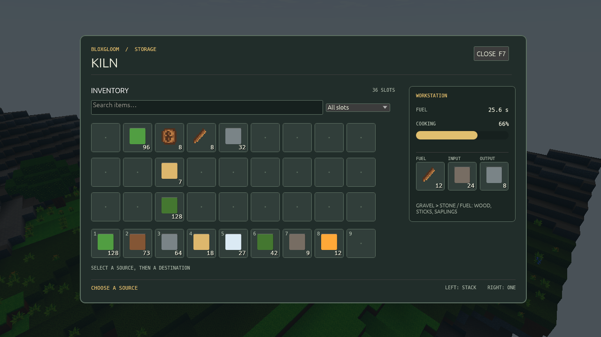
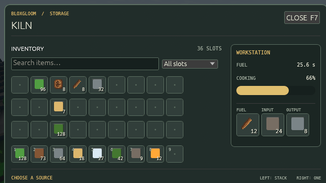

# egui UI preview

Inventory and container screens now use egui directly. Press **E** (or the
configured inventory key) to open the pack, or interact with a container;
press **Escape** or the close button to return to play. The egui screen
reads the current inventory and container view. Clicking
a source slot and then a destination sends the game's existing inventory move
or container transfer request to the server. Right-clicking a container transfer
moves up to one item. The server still decides whether each request applies.

The overlay exercises egui text input, a drop-down slot filter, machine-slot
scrolling, buttons, keyboard focus, pointer input, clipboard integration, and
rendering into the existing wgpu surface. The inventory grid uses egui input
with custom slot and item-icon painting. Package documents, menus, HUD and
joining screens now use the same renderer and input path.

To try it with the built-in kiln, run:

```sh
cargo run -- local /tmp/bloxgloom-egui-poc-world
```

Open a kiln to see its egui screen. To try the authored press, use a fresh save:

```sh
cargo run -- local-packages fixtures/phase4-showcase/packages /tmp/bloxgloom-egui-showcase-world
```

The branch pins Rust 1.95 because egui 0.36 requires it. `rustup` installs the
toolchain when needed. For headless screenshots of the egui screens over the
game's preview scene at desktop and compact sizes, run
`cargo run -- egui-preview /tmp/egui-previews`.




