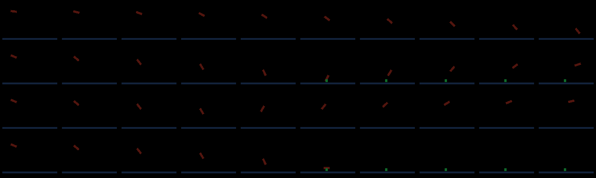

# Authoritative moving entities

Declare simple moving objects and projectiles with `host.register_moving_entity`.
The server owns integration, collision, lifetime, persistence and impact reactions.
Behavior callbacks use ordinary gameplay transactions. Cuboid models and client
sparks provide presentation; they do not apply collision outcomes or rewards.

The runnable example is [moving-projectiles](../../fixtures/moving-projectiles/README.md).
The native declaration is `bloxgloom_host_api::motion::MovingEntity`; Luau editor
definitions include `BloxMovingDeclaration`, `BloxMotion` and typed moving events.

## Declaration

Require all three contracts in `package.txt`:

```text
requires bloxgloom:content/v1
requires bloxgloom:actions/v1
requires bloxgloom:moving_entities/v1
```

```lua
h.register_moving_entity({
    key = "demo:arrow", module = "demo:arrow_behavior", schema = 1, revision = 1,
    max_state_bytes = 1, max_public_bytes = 1,
    interval = 10, lifetime_ticks = 500,
    handles_impact = true, handles_expiry = true,
    body = {
        origin = "center", half_extents = {0.1, 0.1, 0.1},
        collisions = {terrain = true, players = false, creatures = false},
        response = "stop", restitution = 0, gravity_scale = 1,
        max_speed = 24, max_acceleration = 32,
    },
    model = {{min = {-0.1,-0.1,-0.1}, max = {0.1,0.1,0.1}, color = {0.3,0.8,0.2}}},
})
```

Position is the **body center**. Half extents describe an axis-aligned collision
box. Model coordinates are offsets from that same center. Distances are blocks;
velocity is blocks/second; acceleration is blocks/second². Orientation is a unit
quaternion `[x,y,z,w]`, used for model presentation. Rotating the model does not
rotate the collision box.

The key and behavior module belong to the declaring package. State uses a fixed
binary length equal to `max_state_bytes`; the first `max_public_bytes` are exposed
as public authored bytes. A zero public prefix is allowed. The host separately
encodes its motion envelope; `c.entity_state` and `c.update_entity` operate on
authored state rather than that envelope. Use `revision` when behavior or schema
changes; frozen source and body/model policy also participate in compatibility.

`model` may be omitted. A declared model has 1–16 colored cuboids, each with
strictly ordered min/max coordinates within ±4 blocks and RGB values in `[0,1]`.
Parts use `motion="body"`; stride animation belongs to ground creatures.

## Gameplay services

```lua
local reference = c.spawn_moving_entity("demo:arrow", {
    position = {2.5, 82.0, 0.5}, velocity = {16, 0, 0}, state = string.char(0),
    -- orientation defaults to {0,0,0,1}; source is an optional exact entity ID.
})
local pose = c.motion(e.entity)
assert(pose ~= nil)
assert(c.set_motion(e.entity, pose.revision, {velocity = {8, 0, 0}}))
```

The spawn result is an opaque transaction-local allocation reference. It is not
a durable entity ID. The host allocates an exact ID at commit; later callbacks
and replicas expose it. The readonly `reference.ordinal` is zero-based; client
action results expose `result.spawned` entries containing `ordinal` and exact
`entity` handles. Duplicate delivery within the same action epoch repeats the
committed mapping even after the object has despawned. Durable receipt storage
retains the mapping through crash recovery. Reconnecting grants a new action
epoch and rejects requests from the former session.

Autonomous owner jobs have no client `ActionResult`. Native prepared transactions
expose allocated exact IDs at their commit boundary; owner scripts learn exact
IDs through captured owned entities and moving callbacks. Store a correlation
tag in authored state when connecting a later callback to an owner launch.
Do not retain a spawn reference as an entity identity.
`c.configure_spawn(reference, key, options)` replaces that staged launch before
commit. Supply the complete launch options and the same key. A reference from
another invocation is rejected; failed replacement preserves no partial launch.

`c.motion(id)` returns an owned captured pose or nil: position, velocity,
acceleration, quaternion orientation, exact revision and grounded status. All
nested tables are readonly. `c.motion_contact(id)` separately returns nil or a
readonly `{motion_revision, tick, target, normal}` captured from the same owned
record. Contact is historical host input; capture current target state before
applying a conditional effect. `c.set_motion(id, revision, options)` accepts velocity,
acceleration and orientation. Revision is a `BloxRevision` token, not a numeric
counter. It cannot change position. Other packages' motion cannot be mutated
through ordinary owned services.

Vector inputs must be plain dense numeric sequences with finite components.
All motion operations join the same transaction as inventory, authored state,
terrain and drop operations. Spawn overlap, invalid state, ownership errors,
stale captures and capacity failures reject the affected transaction. Catching a
host error with `pcall` does not permit earlier staged effects to commit.

An optional exact `source` identifies the launch entity and suppresses collision
with it for the declared `source_exclusion_ticks` interval. Exclusion does not
grant inventory, movement or state authority over the source. Keep a stable
profile token or other attribution tag in authored state when a later callback
needs to award credit after the source despawns or reconnects.

## Behavior events

The declaration automatically registers a `MovingTick` handler for its behavior
module. `handles_impact` and `handles_expiry`, both false by default, opt into the
other callbacks. Their generated registrations count toward the package's normal
32-handler limit.

| Kind | Fields |
| --- | --- |
| `MovingTick` | `entity`, `tick`, captured `motion` |
| `MovingImpact` | `entity`, `motion_revision`, `tick`, contact `position`, `normal`, `incoming_velocity`, `target`, `blocked` |
| `MovingExpiry` | `entity`, `motion_revision`, `tick`, `reason` (`Lifetime` or `WorldBoundary`) |

Moving callbacks have no implicit acting player and no admin permission.
`c.players()` supplies a captured directory, and `c.world_time()` supplies the
captured logical clock. A package with `players/v1` may use existing authorized
profile inventory operations and registered package-owned profile state. Their
finite inventory limits, exact revisions and ownership checks still apply;
profile rewards commit atomically with the moving reaction and its other effects.
Select an explicit profile handle rather than using the actor shorthand
`"player"`. Admin-only operations require a separate authorized action.

Terrain targets contain `{kind="Terrain",cell,state}`. Entity targets contain
`{kind="Entity",entity,revision}` with exact handles. Contact position is the
body's surface point; the normal points away from the collided target. Incoming
velocity precedes the declared host response. `blocked` identifies an initial
overlap or exhausted collision processing.

```lua
return function(c: BloxGameplayContext, e: BloxGameplayEvent): ()
    if e.kind == "MovingImpact" then
        if e.target.kind == "Terrain" then
            local cell = e.target.cell
            -- Read current captured terrain before staging a conditional effect.
            local block = c.block(cell[1], cell[2], cell[3])
            if block.state == e.target.state then
                assert(c.remove_entity(e.entity))
            end
        end
    end
end
```

There is no implicit health model. A hit gives an exact target; damage requires
an explicitly available gameplay contract. Existing inventory and terrain rules
continue to apply.

## Integration, reactions and persistence

Integration uses a fixed 0.04-second step (two logical ticks), independently of
behavior cadence. A live body can take at most two separate fixed steps in one
transaction to recover a short commit delay. The solver captures the complete
bounded horizon and splits each dynamic collider's committed displacement across
the steps. First activation, restart, dormancy and unavailable-terrain recovery
start with one step; they do not catch up elapsed inactive time. Saturation can
still slow simulation rather than creating an unbounded backlog.

Semi-implicit Euler adds acceleration before computing the
swept displacement. Gravity subtracts `20 * gravity_scale` from vertical
acceleration. Integrated speed is capped at the declaration's maximum. Terrain
collision sweeps the complete box displacement rather than checking endpoints.
Stop removes velocity; bounce reflects its normal component with restitution;
slide removes the inward normal component. Responses use the target's moving
frame and remain capped by the declared maximum speed. Bounce and slide capture
a conservative envelope covering reflected paths, rather than reusing only the
initial straight sweep. At most four contacts resolve in one step.

A new contact with an impact handler pauses at its contact pose after applying
the host response; the remaining displacement is discarded. Once its reaction
commits, integration resumes on the next step. Without an impact handler, the
host continues the remaining displacement through bounded contact iterations.
Resting target and normal suppress repeat reactions while preserving tangent
slide motion under gravity. Contact clears once the body separates. Persisted
resting centers round away from the touched face so floating-point conversion
cannot turn a resting body into an embedded body.

Earliest contact wins. Equal-time targets sort terrain, players, then creatures;
terrain sorts by X/Y/Z cell and targets by exact identity. Axis ties resolve X,
then Y, then Z. Determinism applies to identical captured inputs on the supported
runtime, without a promise of identical floating-point results on every CPU.

The motion commit persists a pending impact before its reaction executes. A
pending reaction suspends subsequent integration. Its transaction consumes the
pending record together with authorized effects. Retry may execute the callback
again, but committed rewards and edits happen once. A failed callback preserves
the pending record. Packages that omit an impact handler use the host response
without an authored reaction.

An authorized admin can call `c.cancel_moving_entity(id)` to remove an owned
moving object and its pending reaction together, without applying its failed
effects. The moving seed fixture binds this to `/throw:cancelprojectiles` for
nearby owned projectiles. Ordinary `remove_entity` remains available to owned
gameplay reactions.

Persisted records contain pose, velocity, acceleration, orientation, contact,
remaining active lifetime, behavior deadline, source exclusion and pending
reaction. Restart resumes committed state. Dormancy and server downtime do not
advance lifetime or produce unbounded catch-up motion. Missing captured terrain
pauses integration; it is never replaced by client fallback terrain or air.
Owner transfer across chunk seams remains part of the entity commit.

Player collision/source handles identify an exact session, rather than a stable
profile. Each server boot reserves a distinct session-ID range durably in
`session-generation.bin`. Keep that file with the world save: a pending historical
hit or launch source must never resolve to a different player after restart.
Existing stable profile identities continue to own player inventory.

## Admission limits

| Resource | Bound |
| --- | --- |
| Moving declarations per Luau package | 8 |
| Moving declarations per installation | 128 |
| Fixed authored private state | 1–4096 bytes |
| Public authored state prefix | 0–min(private length, 4000) bytes |
| Model parts | 1–16 when model is supplied |
| Half extent, each axis | 0.025–1.5 blocks |
| Maximum speed | 0–64 blocks/second |
| Maximum authored acceleration | 0–128 blocks/second² |
| Gravity scale; restitution | 0–4; 0–1 |
| Behavior interval | 1–1000 logical ticks |
| Active lifetime | 1–72,000 logical ticks |
| Source exclusion | 0–20 logical ticks |
| Live moving bodies | 256 total; 64 per owner chunk |
| Swept voxel capture | 4096 cells per step |
| Dynamic collider capture | 64 per step |
| Committed ground-creature pose history | 1024 creatures, five tick frames |
| Contact iterations | 4 per integration |

Limits reject or suspend work rather than silently removing colliders. Native
declarations share host validation; native authored-state bounds can exceed the
Luau startup adapter's 4096-byte limit within the durable record envelope.

## Compatibility and presentation

Moving metadata uses client artifact V45, client runtime 9 and wire version 20.
Durable action receipts use schema V2. The default prerelease world directory is
`world-v21`; incompatible earlier saves are not converted.

Clients interpolate committed position and quaternion orientation. There is no
position extrapolation. Stops, impacts, corrections and removal clamp or clear
retained visual poses. The public motion revision is separate from the generic
entity position revision: a velocity/orientation change can occur without a
position change. Clients clear retained motion and action mappings on session
replacement. Models use rigid orientation without creature walking animations.

Ground creatures keep their existing locomotion and animation contracts. General
vehicles, imported meshes, animation controllers and audio are separate work.

## Acceptance evidence

The [measured capacity and renderer comparison](moving-entities/PERFORMANCE.md)
include reproducible commands and their limits. The hard 256-body cap bounds
work safely; it does not guarantee the server's 20 ms tick budget. On the measured
Apple M1 Pro, 64 bodies with every-tick Lua callbacks stayed within that budget at
p99; 256 exceeded it even with ten-tick callbacks.

Real nonblocking TCP tests cover finite launch inventory, exact launch receipts,
terrain/player/creature impacts, atomic profile/inventory/drop reactions, failed
reaction recovery and admin cancellation, source-session identity, chunk seam
transfer, dormant bodies, cold terrain loading and restart. Capacity probes also
verify rejected launches preserve inventory and persisted bodies.



The production GPU filmstrip shows launch, bounce, guided orientation and
impact/removal across successive frames (rows from top to bottom). Rigid rotation
and existing creature animations have separate regression checks. This preview
checks rendering behavior; the live-listener tests check server authority.

Verification commands: `cargo test --workspace --all-features -- --test-threads=2`,
`cargo fmt --all -- --check`, and
`cargo clippy --all-targets --all-features -- -D warnings`. The workspace run
passed 1347 application tests and 45 host-API tests, with five opt-in tests ignored.
After lint cleanup and correcting an owner-test module path, host-API and focused
motion regressions were rerun. The opt-in motion capacity probe was exercised
separately in release mode as described in the measurements.
