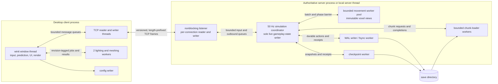
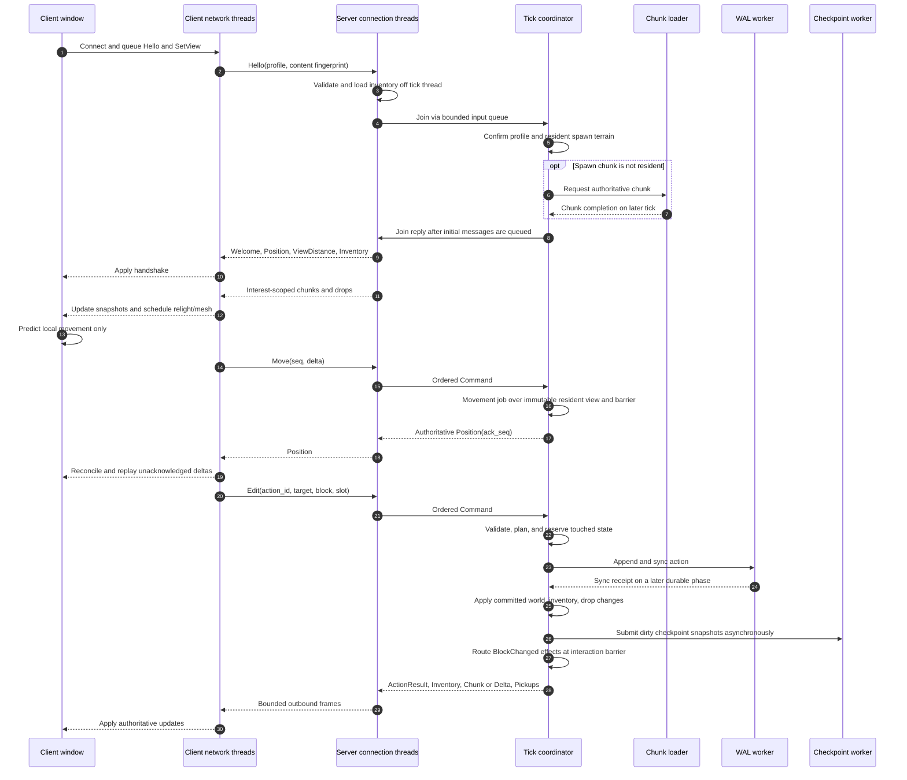
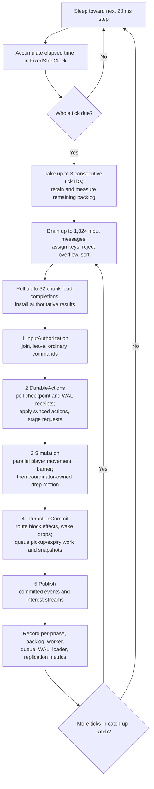

# Runtime architecture: events, clients, and server ticks

This describes the **implemented runtime** as of September 2026. The server is authoritative for terrain, edits, movement, inventories, and drops. The client owns input, local movement prediction, presentation, lighting, and meshing. A local game uses the same TCP client/server path as a dedicated game. The [server simulation design](server-simulation.md) discusses intended growth; where that design exceeds the running code, this document says so explicitly.

## Ownership and execution boundaries

The coordinator owns `State`: resident world chunks, connected players, pending movement, inventories, drops, durable-action state, interest tracking, and replication queues. Socket threads decode/encode frames but do not mutate gameplay state. Chunk loaders and movement workers return results; the coordinator installs or applies them at explicit boundaries. The movement pool is the only gameplay simulation currently parallelized. Drop physics and durable commits run on the coordinator. File I/O, network I/O, client lighting/meshing, and config writes stay off the window thread; server socket, chunk-loading, and checkpoint/WAL I/O stay off the tick thread.

The server starts by opening the save, replaying its write-ahead log (WAL), establishing authoritative spawn terrain, and freezing its built-in system plan. It then ticks even when no players are connected. The server supports at most 16 concurrent connections; a client profile may have only one active connection.

## Event model: what crosses each boundary

There is **no general-purpose event bus**. These are bounded, typed handoffs with distinct authority and timing:

| Boundary | Data | Owner and handling |
| --- | --- | --- |
| Client → TCP | `ClientMessage`: `Hello`, `Move`, `Edit`, `InventoryMove`, `DropStack`, `Resync`, `SetView`, `Ping` | Client writer serializes versioned frames. The server connection thread validates the handshake and decodes later messages. `Move` carries a prediction sequence; durable commands carry an action ID. |
| TCP → tick | `SimulationInput::{Join, Command, Leave}` | Connection threads use a bounded input channel. Each tick drains at most 1,024 entries and sorts them by `OrderKey(tick, source, sequence)` before input authorization. `source=0` orders joins; command/leave sequences come from the connection reader. |
| Input → durable work | `DurableRequest` and `CommitAction` | Edit, inventory move, and drop-stack commands are authorized/planned against authoritative state. Pickup and expiry requests are generated by the server. Conflicts or missing authoritative chunks defer work; invalid/no-op actions receive explicit results. |
| Durable work → live state | WAL sync receipt | A planned action is staged with reserved keys, written and synced by a worker, then applied to world/inventory/drops only when the coordinator polls a successful receipt. Apply builds the publication payload and remembers checkpoint snapshots. Disk failure stops the authoritative coordinator; it does not acknowledge an unsafe state as committed. |
| Committed edit → interaction barrier | `EffectEnvelope { OrderKey, Effect }` | Current live effect is `BlockChanged`. Routing expands it to touching chunk owners, checks total/per-owner bounds, and sorts by owner and order key. The current consumer deduplicates cells and wakes nearby resting drops. This is not yet a generic mod-event dispatcher. |
| Server → TCP → client | `ServerMessage`: welcome/position, chunks/deltas, action/inventory results, drops/pickups, view distance/pong | The coordinator queues bounded per-client frames; a separate writer serializes them. Replication is interest-scoped. `Position` and simple control replies may be queued before the Publish phase; durable edits, inventories, and pickup events only enter publication after commit. |
| Client snapshots → graphics | relight/mesh jobs and upload results | Client replaces chunk snapshots or applies consecutive deltas, requests resync on a gap, and relights affected seams. Mesh results carry chunk and lighting revisions; stale results are discarded before GPU upload. Drop pop, hover, spin, and pickup flight are visual only. |

`OrderKey` gives deterministic order **within an admitted tick**, not a promise that independent network clients arrive in a particular wall-clock order. A bounded effect buffer rejects the *whole* producer result on overflow; routing likewise returns no partial batch. A local effect and a cross-chunk effect use the same InteractionCommit barrier. A newly awakened drop is next tick's simulation work: the drop simulation phase has already run in the current tick.

## Connection, action, and replication lifecycle

The initial four messages are queued **before** the coordinator registers the joined client, so terrain cannot overtake `Welcome`. A join can be deferred while spawn terrain loads or a profile action is pending; stale inventory snapshots are explicitly refreshed. A later disconnect enqueues `Leave`, which removes the client at an input phase. On chunk version gaps, the client asks for `Resync`; it does not promote procedural fallback terrain into authoritative state. Client prediction affects only the local camera position until a server `Position` acknowledges and corrects it.

Durable action IDs are profile-scoped receipts used to avoid reapplying a repeated action. The 128-block stack cap and all inventory/drop transfers are enforced server-side. Checkpoints are asynchronous snapshots of already committed state; the WAL is the commit gate. Pickup and expiry are server-generated durable actions, not client animation callbacks.

## Fixed-step server event loop

The five phase names and order are fixed. A startup-frozen registry validates built-in IDs, access declarations, dependencies, and budgets; the runtime dispatches those known built-ins. It does **not** dynamically run arbitrary registered mod systems today. The simulation phase first batches player movement against immutable, revision-checked resident voxel views, waits for the worker barrier, then applies results in stable owner/job order. Missing chunks are requested rather than guessed. Drop motion follows on the coordinator. The interaction phase queues pickups/expiry for a subsequent durable phase, preventing an animation or a worker from directly changing ownership.

The clock never silently skips an owed simulation tick. It executes at most three catch-up ticks per outer pass and leaves excess time as measurable backlog. This preserves tick order but does **not** guarantee 50 Hz under sustained overload; latency and backlog can grow until the workload is reduced. The coordinator records tick/phase percentiles, movement utilization, WAL and chunk-load latency, queue depths, resident chunks, active clients/drops, and outbound bytes/rejections.

## Capacity, failure, and growth constraints

- Admission is bounded: 1,024 server input messages, 128 outbound frames per client, 256 deferred durable requests, 256 pending WAL actions, and bounded loader/movement queues. The client also has bounded network and mesh queues. A full input or outbound path rejects/disconnects rather than silently dropping an authoritative command or accumulating unbounded memory. Loader saturation defers chunk work; a client never receives an invented authoritative chunk.
- Movement workers cannot mutate world state. Their result is checked against captured chunk revisions before commit. Chunk snapshots and deltas carry versions; client lighting/mesh work carries revisions so old results cannot overwrite newer terrain.
- A WAL write error, a WAL receipt-channel failure, an in-memory apply failure after a successful WAL sync, or an authoritative chunk-load failure terminates the coordinator and disconnects clients. Recovery replays the log on restart. This is deliberately fail-closed, not a best-effort continuation with uncertain ownership.
- The routing types already model deterministic cross-chunk effects, and the registry models resource access and owner partitions. Current gameplay only emits `BlockChanged` wakeups; `WakeDrop` is typed but unused, and chunk/profile-partitioned gameplay execution, fire/growth, multi-chunk block entities, and public mod hooks are **not implemented**. Adding one requires a concrete owner, capacity policy, deterministic commit phase, persistence/replication semantics, and useful behavior tests—not just a registry entry.
- The headless server benchmark exercises clustered and spread 16-player workloads, but it does not measure 16 real TCP clients or live presentation. Sustained multiplayer latency, high-density drops, checkpoint pressure, and post-failure recovery remain operational validation targets; the architecture must not be mistaken for proof those loads are already met.

## Code map

| Concern | Entry points |
| --- | --- |
| Wire protocol and client event loop | [`src/protocol.rs`](../src/protocol.rs), [`src/client/events.rs`](../src/client/events.rs), [`src/client.rs`](../src/client.rs), [`src/client/workers.rs`](../src/client/workers.rs) |
| Server ownership, connection lifecycle, tick loop | [`src/server.rs`](../src/server.rs), [`src/server/net.rs`](../src/server/net.rs), [`src/server/runtime.rs`](../src/server/runtime.rs) |
| Clock, ordering, system plan, worker barrier | [`src/server/simulation.rs`](../src/server/simulation.rs), [`src/server/builtins.rs`](../src/server/builtins.rs), [`src/server/registry.rs`](../src/server/registry.rs), [`src/server/parallel.rs`](../src/server/parallel.rs) |
| Durable commit, effects, streaming | [`src/server/durable/`](../src/server/durable/), [`src/server/effects.rs`](../src/server/effects.rs), [`src/server/streaming.rs`](../src/server/streaming.rs) |
